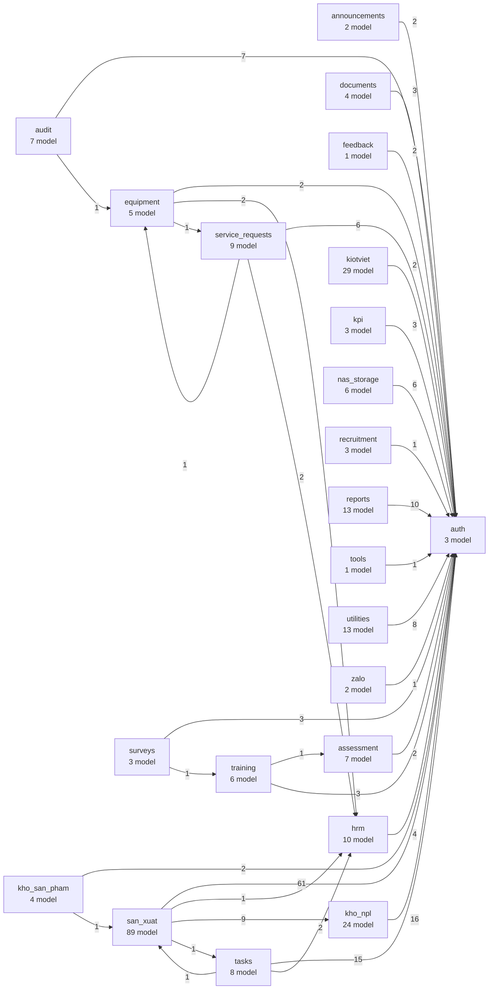

# Class diagram — PortalJustPlay

Sinh tự động: `docker compose exec -T web python scripts/gen_class_diagram.py`

## Sơ đồ phụ thuộc giữa các module

## Chi tiết từng module

| Module | Model | Sơ đồ |
|---|---|---|
| `san_xuat` | 89 | [san_xuat.md](./san_xuat.md) |
| `kiotviet` | 29 | [kiotviet.md](./kiotviet.md) |
| `kho_npl` | 24 | [kho_npl.md](./kho_npl.md) |
| `reports` | 13 | [reports.md](./reports.md) |
| `utilities` | 13 | [utilities.md](./utilities.md) |
| `hrm` | 10 | [hrm.md](./hrm.md) |
| `service_requests` | 9 | [service_requests.md](./service_requests.md) |
| `tasks` | 8 | [tasks.md](./tasks.md) |
| `assessment` | 7 | [assessment.md](./assessment.md) |
| `audit` | 7 | [audit.md](./audit.md) |
| `training` | 6 | [training.md](./training.md) |
| `nas_storage` | 6 | [nas_storage.md](./nas_storage.md) |
| `equipment` | 5 | [equipment.md](./equipment.md) |
| `documents` | 4 | [documents.md](./documents.md) |
| `kho_san_pham` | 4 | [kho_san_pham.md](./kho_san_pham.md) |
| `auth` | 3 | [auth.md](./auth.md) |
| `recruitment` | 3 | [recruitment.md](./recruitment.md) |
| `kpi` | 3 | [kpi.md](./kpi.md) |
| `surveys` | 3 | [surveys.md](./surveys.md) |
| `announcements` | 2 | [announcements.md](./announcements.md) |
| `zalo` | 2 | [zalo.md](./zalo.md) |
| `feedback` | 1 | [feedback.md](./feedback.md) |
| `tools` | 1 | [tools.md](./tools.md) |

Tổng: **23 module**, **252 model**.
