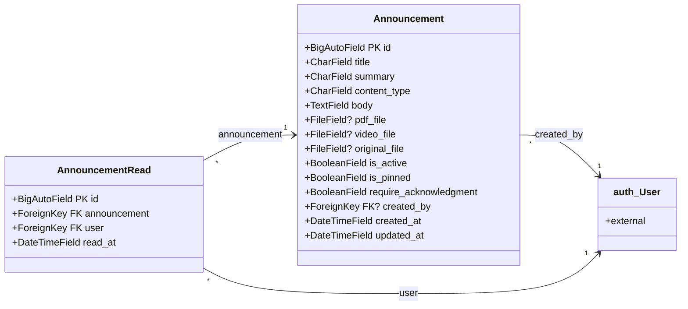

# Class diagram — `announcements`

2 model. Class có tiền tố `app_` là model thuộc app khác.

```mermaid
classDiagram
    direction LR
    class Announcement {
    +BigAutoField PK id
    +CharField title
    +CharField summary
    +CharField content_type
    +TextField body
    +FileField? pdf_file
    +FileField? video_file
    +FileField? original_file
    +BooleanField is_active
    +BooleanField is_pinned
    +BooleanField require_acknowledgment
    +ForeignKey FK? created_by
    +DateTimeField created_at
    +DateTimeField updated_at
    }
    class AnnouncementRead {
    +BigAutoField PK id
    +ForeignKey FK announcement
    +ForeignKey FK user
    +DateTimeField read_at
    }

    class auth_User {
    +external
    }

    Announcement "*" --> "1" auth_User : created_by
    AnnouncementRead "*" --> "1" Announcement : announcement
    AnnouncementRead "*" --> "1" auth_User : user
```
