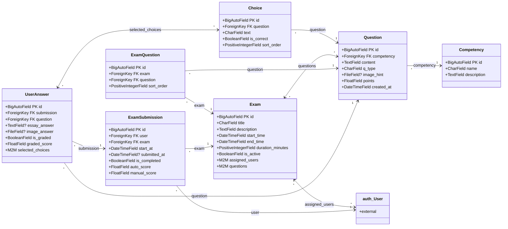

# Class diagram — `assessment`

7 model. Class có tiền tố `app_` là model thuộc app khác.

```mermaid
classDiagram
    direction LR
    class Choice {
    +BigAutoField PK id
    +ForeignKey FK question
    +CharField text
    +BooleanField is_correct
    +PositiveIntegerField sort_order
    }
    class Competency {
    +BigAutoField PK id
    +CharField name
    +TextField description
    }
    class Exam {
    +BigAutoField PK id
    +CharField title
    +TextField description
    +DateTimeField start_time
    +DateTimeField end_time
    +PositiveIntegerField duration_minutes
    +BooleanField is_active
    +M2M assigned_users
    +M2M questions
    }
    class ExamQuestion {
    +BigAutoField PK id
    +ForeignKey FK exam
    +ForeignKey FK question
    +PositiveIntegerField sort_order
    }
    class ExamSubmission {
    +BigAutoField PK id
    +ForeignKey FK user
    +ForeignKey FK exam
    +DateTimeField start_at
    +DateTimeField? submitted_at
    +BooleanField is_completed
    +FloatField auto_score
    +FloatField manual_score
    }
    class Question {
    +BigAutoField PK id
    +ForeignKey FK competency
    +TextField content
    +CharField q_type
    +FileField? image_hint
    +FloatField points
    +DateTimeField created_at
    }
    class UserAnswer {
    +BigAutoField PK id
    +ForeignKey FK submission
    +ForeignKey FK question
    +TextField? essay_answer
    +FileField? image_answer
    +BooleanField is_graded
    +FloatField graded_score
    +M2M selected_choices
    }

    class auth_User {
    +external
    }

    Choice "*" --> "1" Question : question
    Exam "*" <--> "*" auth_User : assigned_users
    Exam "*" <--> "*" Question : questions
    ExamQuestion "*" --> "1" Exam : exam
    ExamQuestion "*" --> "1" Question : question
    ExamSubmission "*" --> "1" auth_User : user
    ExamSubmission "*" --> "1" Exam : exam
    Question "*" --> "1" Competency : competency
    UserAnswer "*" --> "1" ExamSubmission : submission
    UserAnswer "*" --> "1" Question : question
    UserAnswer "*" <--> "*" Choice : selected_choices
```
