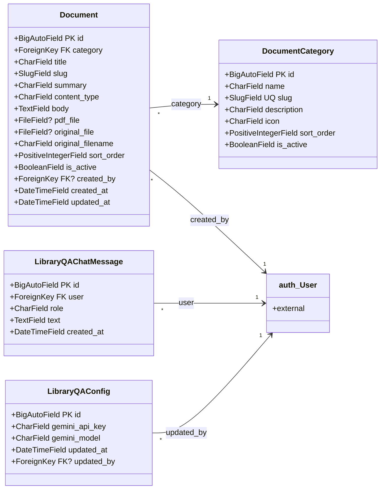

# Class diagram — `documents`

4 model. Class có tiền tố `app_` là model thuộc app khác.

```mermaid
classDiagram
    direction LR
    class Document {
    +BigAutoField PK id
    +ForeignKey FK category
    +CharField title
    +SlugField slug
    +CharField summary
    +CharField content_type
    +TextField body
    +FileField? pdf_file
    +FileField? original_file
    +CharField original_filename
    +PositiveIntegerField sort_order
    +BooleanField is_active
    +ForeignKey FK? created_by
    +DateTimeField created_at
    +DateTimeField updated_at
    }
    class DocumentCategory {
    +BigAutoField PK id
    +CharField name
    +SlugField UQ slug
    +CharField description
    +CharField icon
    +PositiveIntegerField sort_order
    +BooleanField is_active
    }
    class LibraryQAChatMessage {
    +BigAutoField PK id
    +ForeignKey FK user
    +CharField role
    +TextField text
    +DateTimeField created_at
    }
    class LibraryQAConfig {
    +BigAutoField PK id
    +CharField gemini_api_key
    +CharField gemini_model
    +DateTimeField updated_at
    +ForeignKey FK? updated_by
    }

    class auth_User {
    +external
    }

    Document "*" --> "1" DocumentCategory : category
    Document "*" --> "1" auth_User : created_by
    LibraryQAChatMessage "*" --> "1" auth_User : user
    LibraryQAConfig "*" --> "1" auth_User : updated_by
```
