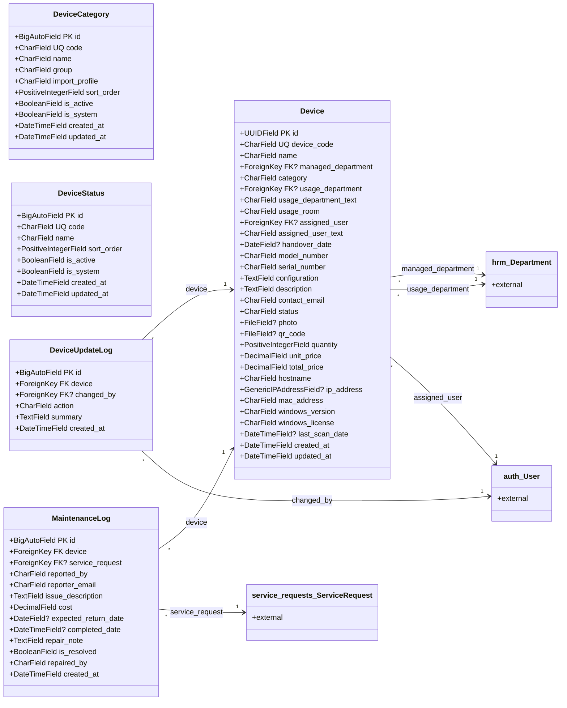

# Class diagram — `equipment`

5 model. Class có tiền tố `app_` là model thuộc app khác.

```mermaid
classDiagram
    direction LR
    class Device {
    +UUIDField PK id
    +CharField UQ device_code
    +CharField name
    +ForeignKey FK? managed_department
    +CharField category
    +ForeignKey FK? usage_department
    +CharField usage_department_text
    +CharField usage_room
    +ForeignKey FK? assigned_user
    +CharField assigned_user_text
    +DateField? handover_date
    +CharField model_number
    +CharField serial_number
    +TextField configuration
    +TextField description
    +CharField contact_email
    +CharField status
    +FileField? photo
    +FileField? qr_code
    +PositiveIntegerField quantity
    +DecimalField unit_price
    +DecimalField total_price
    +CharField hostname
    +GenericIPAddressField? ip_address
    +CharField mac_address
    +CharField windows_version
    +CharField windows_license
    +DateTimeField? last_scan_date
    +DateTimeField created_at
    +DateTimeField updated_at
    }
    class DeviceCategory {
    +BigAutoField PK id
    +CharField UQ code
    +CharField name
    +CharField group
    +CharField import_profile
    +PositiveIntegerField sort_order
    +BooleanField is_active
    +BooleanField is_system
    +DateTimeField created_at
    +DateTimeField updated_at
    }
    class DeviceStatus {
    +BigAutoField PK id
    +CharField UQ code
    +CharField name
    +PositiveIntegerField sort_order
    +BooleanField is_active
    +BooleanField is_system
    +DateTimeField created_at
    +DateTimeField updated_at
    }
    class DeviceUpdateLog {
    +BigAutoField PK id
    +ForeignKey FK device
    +ForeignKey FK? changed_by
    +CharField action
    +TextField summary
    +DateTimeField created_at
    }
    class MaintenanceLog {
    +BigAutoField PK id
    +ForeignKey FK device
    +ForeignKey FK? service_request
    +CharField reported_by
    +CharField reporter_email
    +TextField issue_description
    +DecimalField cost
    +DateField? expected_return_date
    +DateTimeField? completed_date
    +TextField repair_note
    +BooleanField is_resolved
    +CharField repaired_by
    +DateTimeField created_at
    }

    class auth_User {
    +external
    }
    class hrm_Department {
    +external
    }
    class service_requests_ServiceRequest {
    +external
    }

    Device "*" --> "1" hrm_Department : managed_department
    Device "*" --> "1" hrm_Department : usage_department
    Device "*" --> "1" auth_User : assigned_user
    DeviceUpdateLog "*" --> "1" Device : device
    DeviceUpdateLog "*" --> "1" auth_User : changed_by
    MaintenanceLog "*" --> "1" Device : device
    MaintenanceLog "*" --> "1" service_requests_ServiceRequest : service_request
```
