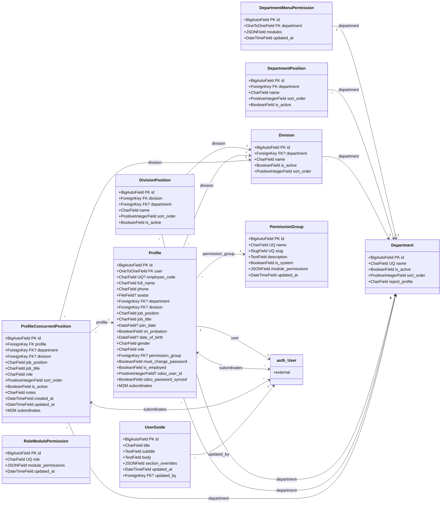

# Class diagram — `hrm`

10 model. Class có tiền tố `app_` là model thuộc app khác.

```mermaid
classDiagram
    direction LR
    class Department {
    +BigAutoField PK id
    +CharField UQ name
    +BooleanField is_active
    +PositiveIntegerField sort_order
    +CharField report_profile
    }
    class DepartmentMenuPermission {
    +BigAutoField PK id
    +OneToOneField FK department
    +JSONField modules
    +DateTimeField updated_at
    }
    class DepartmentPosition {
    +BigAutoField PK id
    +ForeignKey FK department
    +CharField name
    +PositiveIntegerField sort_order
    +BooleanField is_active
    }
    class Division {
    +BigAutoField PK id
    +ForeignKey FK? department
    +CharField name
    +BooleanField is_active
    +PositiveIntegerField sort_order
    }
    class DivisionPosition {
    +BigAutoField PK id
    +ForeignKey FK division
    +ForeignKey FK? department
    +CharField name
    +PositiveIntegerField sort_order
    +BooleanField is_active
    }
    class PermissionGroup {
    +BigAutoField PK id
    +CharField UQ name
    +SlugField UQ slug
    +TextField description
    +BooleanField is_system
    +JSONField module_permissions
    +DateTimeField updated_at
    }
    class Profile {
    +BigAutoField PK id
    +OneToOneField FK user
    +CharField UQ? employee_code
    +CharField full_name
    +CharField phone
    +FileField? avatar
    +ForeignKey FK? department
    +ForeignKey FK? division
    +CharField job_position
    +CharField job_title
    +DateField? join_date
    +BooleanField on_probation
    +DateField? date_of_birth
    +CharField gender
    +CharField role
    +ForeignKey FK? permission_group
    +BooleanField must_change_password
    +BooleanField is_employed
    +PositiveIntegerField? odoo_user_id
    +BooleanField odoo_password_synced
    +M2M subordinates
    }
    class ProfileConcurrentPosition {
    +BigAutoField PK id
    +ForeignKey FK profile
    +ForeignKey FK? department
    +ForeignKey FK? division
    +CharField job_position
    +CharField job_title
    +CharField role
    +PositiveIntegerField sort_order
    +BooleanField is_active
    +CharField notes
    +DateTimeField created_at
    +DateTimeField updated_at
    +M2M subordinates
    }
    class RoleModulePermission {
    +BigAutoField PK id
    +CharField UQ role
    +JSONField module_permissions
    +DateTimeField updated_at
    }
    class UserGuide {
    +BigAutoField PK id
    +CharField title
    +TextField subtitle
    +TextField body
    +JSONField section_overrides
    +DateTimeField updated_at
    +ForeignKey FK? updated_by
    }

    class auth_User {
    +external
    }

    DepartmentMenuPermission "1" --> "1" Department : department
    DepartmentPosition "*" --> "1" Department : department
    Division "*" --> "1" Department : department
    DivisionPosition "*" --> "1" Division : division
    DivisionPosition "*" --> "1" Department : department
    Profile "1" --> "1" auth_User : user
    Profile "*" --> "1" Department : department
    Profile "*" --> "1" Division : division
    Profile "*" --> "1" PermissionGroup : permission_group
    Profile "*" <--> "*" auth_User : subordinates
    ProfileConcurrentPosition "*" --> "1" Profile : profile
    ProfileConcurrentPosition "*" --> "1" Department : department
    ProfileConcurrentPosition "*" --> "1" Division : division
    ProfileConcurrentPosition "*" <--> "*" auth_User : subordinates
    UserGuide "*" --> "1" auth_User : updated_by
```
