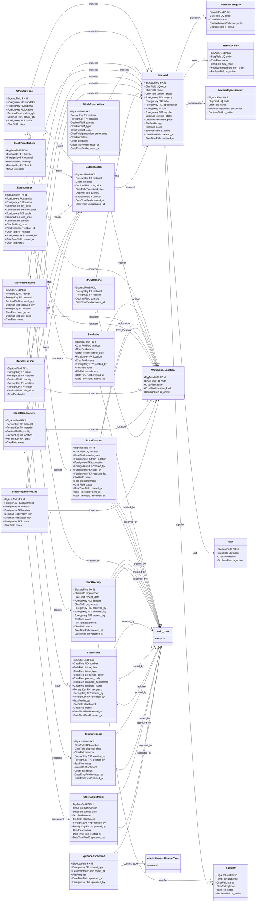

# Class diagram — `kho_npl`

24 model. Class có tiền tố `app_` là model thuộc app khác.

```mermaid
classDiagram
    direction LR
    class Material {
    +BigAutoField PK id
    +CharField UQ code
    +CharField name
    +CharField variant_group
    +ForeignKey FK category
    +ForeignKey FK? color
    +ForeignKey FK? specification
    +ForeignKey FK unit
    +ForeignKey FK? supplier
    +DecimalField min_stock
    +DecimalField base_price
    +FileField image
    +TextField notes
    +BooleanField is_active
    +DateTimeField created_at
    +DateTimeField updated_at
    }
    class MaterialBatch {
    +BigAutoField PK id
    +ForeignKey FK material
    +CharField code
    +DecimalField unit_price
    +DateField? received_date
    +DecimalField quantity
    +BooleanField is_active
    +DateTimeField created_at
    +DateTimeField updated_at
    }
    class MaterialCategory {
    +BigAutoField PK id
    +SlugField UQ code
    +CharField name
    +PositiveIntegerField sort_order
    +BooleanField is_active
    }
    class MaterialColor {
    +BigAutoField PK id
    +SlugField UQ code
    +CharField name
    +CharField hex_code
    +PositiveIntegerField sort_order
    +BooleanField is_active
    }
    class MaterialSpecification {
    +BigAutoField PK id
    +SlugField UQ code
    +CharField name
    +PositiveIntegerField sort_order
    +BooleanField is_active
    }
    class NplDocAttachment {
    +BigAutoField PK id
    +ForeignKey FK content_type
    +PositiveIntegerField object_id
    +FileField file
    +DateTimeField uploaded_at
    +ForeignKey FK? uploaded_by
    }
    class StockAdjustment {
    +BigAutoField PK id
    +CharField UQ number
    +DateField adjust_date
    +TextField reason
    +FileField attachment
    +ForeignKey FK? proposed_by
    +ForeignKey FK? approved_by
    +CharField status
    +DateTimeField created_at
    +DateTimeField? approved_at
    }
    class StockAdjustmentLine {
    +BigAutoField PK id
    +ForeignKey FK adjustment
    +ForeignKey FK material
    +ForeignKey FK location
    +DecimalField system_qty
    +DecimalField actual_qty
    +ForeignKey FK? batch
    +CharField notes
    }
    class StockBalance {
    +BigAutoField PK id
    +ForeignKey FK material
    +ForeignKey FK location
    +DecimalField quantity
    +DateTimeField updated_at
    }
    class StockDisposal {
    +BigAutoField PK id
    +CharField UQ number
    +DateField disposal_date
    +CharField reason
    +ForeignKey FK? created_by
    +ForeignKey FK? posted_by
    +TextField notes
    +FileField attachment
    +CharField status
    +DateTimeField created_at
    +DateTimeField? posted_at
    }
    class StockDisposalLine {
    +BigAutoField PK id
    +ForeignKey FK disposal
    +ForeignKey FK material
    +DecimalField quantity
    +ForeignKey FK location
    +ForeignKey FK? batch
    +CharField notes
    }
    class StockIssue {
    +BigAutoField PK id
    +CharField UQ number
    +DateField issue_date
    +CharField issue_type
    +CharField production_order
    +CharField product_code
    +CharField recipient_department
    +CharField recipient_name
    +ForeignKey FK? recipient
    +ForeignKey FK? issued_by
    +ForeignKey FK? created_by
    +TextField notes
    +FileField attachment
    +CharField status
    +DateTimeField created_at
    +DateTimeField? posted_at
    }
    class StockIssueLine {
    +BigAutoField PK id
    +ForeignKey FK issue
    +ForeignKey FK material
    +DecimalField quantity
    +ForeignKey FK location
    +ForeignKey FK? batch
    +DecimalField unit_price
    +CharField notes
    }
    class StockLedger {
    +BigAutoField PK id
    +ForeignKey FK material
    +ForeignKey FK location
    +DecimalField qty_delta
    +DecimalField balance_after
    +ForeignKey FK? batch
    +DecimalField unit_price
    +DecimalField amount
    +CharField ref_type
    +PositiveIntegerField ref_id
    +CharField ref_number
    +ForeignKey FK? created_by
    +DateTimeField created_at
    +CharField notes
    }
    class StockReceipt {
    +BigAutoField PK id
    +CharField UQ number
    +DateField receipt_date
    +ForeignKey FK? supplier
    +CharField po_number
    +ForeignKey FK? received_by
    +ForeignKey FK? checked_by
    +ForeignKey FK? created_by
    +TextField notes
    +FileField attachment
    +CharField status
    +DateTimeField created_at
    +DateTimeField? posted_at
    }
    class StockReceiptLine {
    +BigAutoField PK id
    +ForeignKey FK receipt
    +ForeignKey FK material
    +DecimalField ordered_qty
    +DecimalField received_qty
    +ForeignKey FK location
    +CharField batch_code
    +DecimalField unit_price
    +CharField notes
    }
    class StockReservation {
    +BigAutoField PK id
    +ForeignKey FK material
    +ForeignKey FK? location
    +DecimalField quantity
    +CharField ref_type
    +CharField ref_code
    +CharField production_order_code
    +CharField status
    +CharField notes
    +DateTimeField created_at
    +DateTimeField updated_at
    }
    class StockTransfer {
    +BigAutoField PK id
    +CharField UQ number
    +DateField transfer_date
    +ForeignKey FK from_location
    +ForeignKey FK to_location
    +ForeignKey FK? created_by
    +ForeignKey FK? sent_by
    +ForeignKey FK? received_by
    +TextField notes
    +FileField attachment
    +CharField status
    +DateTimeField created_at
    +DateTimeField? sent_at
    +DateTimeField? received_at
    }
    class StockTransferLine {
    +BigAutoField PK id
    +ForeignKey FK transfer
    +ForeignKey FK material
    +DecimalField quantity
    +ForeignKey FK? batch
    +CharField notes
    }
    class Stocktake {
    +BigAutoField PK id
    +CharField UQ number
    +CharField name
    +DateField stocktake_date
    +ForeignKey FK location
    +CharField status
    +ForeignKey FK? created_by
    +TextField notes
    +FileField attachment
    +DateTimeField created_at
    +DateTimeField? closed_at
    }
    class StocktakeLine {
    +BigAutoField PK id
    +ForeignKey FK stocktake
    +ForeignKey FK material
    +ForeignKey FK location
    +DecimalField system_qty
    +DecimalField? actual_qty
    +ForeignKey FK? batch
    +CharField notes
    }
    class Supplier {
    +BigAutoField PK id
    +CharField UQ code
    +CharField name
    +CharField phone
    +TextField notes
    +BooleanField is_active
    }
    class Unit {
    +BigAutoField PK id
    +SlugField UQ code
    +CharField name
    +BooleanField is_active
    }
    class WarehouseLocation {
    +BigAutoField PK id
    +CharField UQ code
    +CharField name
    +CharField location_kind
    +BooleanField is_active
    }

    class auth_User {
    +external
    }
    class contenttypes_ContentType {
    +external
    }

    Material "*" --> "1" MaterialCategory : category
    Material "*" --> "1" MaterialColor : color
    Material "*" --> "1" MaterialSpecification : specification
    Material "*" --> "1" Unit : unit
    Material "*" --> "1" Supplier : supplier
    MaterialBatch "*" --> "1" Material : material
    NplDocAttachment "*" --> "1" contenttypes_ContentType : content_type
    NplDocAttachment "*" --> "1" auth_User : uploaded_by
    StockAdjustment "*" --> "1" auth_User : proposed_by
    StockAdjustment "*" --> "1" auth_User : approved_by
    StockAdjustmentLine "*" --> "1" StockAdjustment : adjustment
    StockAdjustmentLine "*" --> "1" Material : material
    StockAdjustmentLine "*" --> "1" WarehouseLocation : location
    StockAdjustmentLine "*" --> "1" MaterialBatch : batch
    StockBalance "*" --> "1" Material : material
    StockBalance "*" --> "1" WarehouseLocation : location
    StockDisposal "*" --> "1" auth_User : created_by
    StockDisposal "*" --> "1" auth_User : posted_by
    StockDisposalLine "*" --> "1" StockDisposal : disposal
    StockDisposalLine "*" --> "1" Material : material
    StockDisposalLine "*" --> "1" WarehouseLocation : location
    StockDisposalLine "*" --> "1" MaterialBatch : batch
    StockIssue "*" --> "1" auth_User : recipient
    StockIssue "*" --> "1" auth_User : issued_by
    StockIssue "*" --> "1" auth_User : created_by
    StockIssueLine "*" --> "1" StockIssue : issue
    StockIssueLine "*" --> "1" Material : material
    StockIssueLine "*" --> "1" WarehouseLocation : location
    StockIssueLine "*" --> "1" MaterialBatch : batch
    StockLedger "*" --> "1" Material : material
    StockLedger "*" --> "1" WarehouseLocation : location
    StockLedger "*" --> "1" MaterialBatch : batch
    StockLedger "*" --> "1" auth_User : created_by
    StockReceipt "*" --> "1" Supplier : supplier
    StockReceipt "*" --> "1" auth_User : received_by
    StockReceipt "*" --> "1" auth_User : checked_by
    StockReceipt "*" --> "1" auth_User : created_by
    StockReceiptLine "*" --> "1" StockReceipt : receipt
    StockReceiptLine "*" --> "1" Material : material
    StockReceiptLine "*" --> "1" WarehouseLocation : location
    StockReservation "*" --> "1" Material : material
    StockReservation "*" --> "1" WarehouseLocation : location
    StockTransfer "*" --> "1" WarehouseLocation : from_location
    StockTransfer "*" --> "1" WarehouseLocation : to_location
    StockTransfer "*" --> "1" auth_User : created_by
    StockTransfer "*" --> "1" auth_User : sent_by
    StockTransfer "*" --> "1" auth_User : received_by
    StockTransferLine "*" --> "1" StockTransfer : transfer
    StockTransferLine "*" --> "1" Material : material
    StockTransferLine "*" --> "1" MaterialBatch : batch
    Stocktake "*" --> "1" WarehouseLocation : location
    Stocktake "*" --> "1" auth_User : created_by
    StocktakeLine "*" --> "1" Stocktake : stocktake
    StocktakeLine "*" --> "1" Material : material
    StocktakeLine "*" --> "1" WarehouseLocation : location
    StocktakeLine "*" --> "1" MaterialBatch : batch
```
