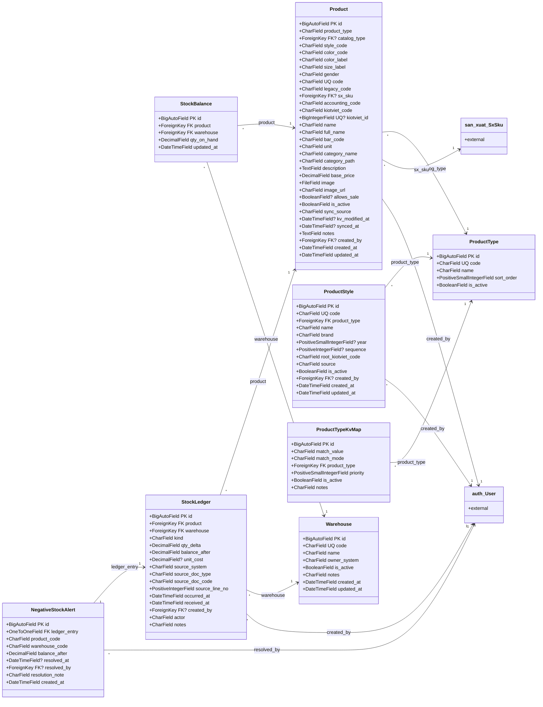

# Class diagram — `kho_san_pham`

8 model. Class có tiền tố `app_` là model thuộc app khác.

```mermaid
classDiagram
    direction LR
    class NegativeStockAlert {
    +BigAutoField PK id
    +OneToOneField FK ledger_entry
    +CharField product_code
    +CharField warehouse_code
    +DecimalField balance_after
    +DateTimeField? resolved_at
    +ForeignKey FK? resolved_by
    +CharField resolution_note
    +DateTimeField created_at
    }
    class Product {
    +BigAutoField PK id
    +CharField product_type
    +ForeignKey FK? catalog_type
    +CharField style_code
    +CharField color_code
    +CharField color_label
    +CharField size_label
    +CharField gender
    +CharField UQ code
    +CharField legacy_code
    +ForeignKey FK? sx_sku
    +CharField accounting_code
    +CharField kiotviet_code
    +BigIntegerField UQ? kiotviet_id
    +CharField name
    +CharField full_name
    +CharField bar_code
    +CharField unit
    +CharField category_name
    +CharField category_path
    +TextField description
    +DecimalField base_price
    +FileField image
    +CharField image_url
    +BooleanField? allows_sale
    +BooleanField is_active
    +CharField sync_source
    +DateTimeField? kv_modified_at
    +DateTimeField? synced_at
    +TextField notes
    +ForeignKey FK? created_by
    +DateTimeField created_at
    +DateTimeField updated_at
    }
    class ProductStyle {
    +BigAutoField PK id
    +CharField UQ code
    +ForeignKey FK product_type
    +CharField name
    +CharField brand
    +PositiveSmallIntegerField? year
    +PositiveIntegerField? sequence
    +CharField root_kiotviet_code
    +CharField source
    +BooleanField is_active
    +ForeignKey FK? created_by
    +DateTimeField created_at
    +DateTimeField updated_at
    }
    class ProductType {
    +BigAutoField PK id
    +CharField UQ code
    +CharField name
    +PositiveSmallIntegerField sort_order
    +BooleanField is_active
    }
    class ProductTypeKvMap {
    +BigAutoField PK id
    +CharField match_value
    +CharField match_mode
    +ForeignKey FK product_type
    +PositiveSmallIntegerField priority
    +BooleanField is_active
    +CharField notes
    }
    class StockBalance {
    +BigAutoField PK id
    +ForeignKey FK product
    +ForeignKey FK warehouse
    +DecimalField qty_on_hand
    +DateTimeField updated_at
    }
    class StockLedger {
    +BigAutoField PK id
    +ForeignKey FK product
    +ForeignKey FK warehouse
    +CharField kind
    +DecimalField qty_delta
    +DecimalField balance_after
    +DecimalField? unit_cost
    +CharField source_system
    +CharField source_doc_type
    +CharField source_doc_code
    +PositiveIntegerField source_line_no
    +DateTimeField occurred_at
    +DateTimeField received_at
    +ForeignKey FK? created_by
    +CharField actor
    +CharField notes
    }
    class Warehouse {
    +BigAutoField PK id
    +CharField UQ code
    +CharField name
    +CharField owner_system
    +BooleanField is_active
    +CharField notes
    +DateTimeField created_at
    +DateTimeField updated_at
    }

    class auth_User {
    +external
    }
    class san_xuat_SxSku {
    +external
    }

    NegativeStockAlert "1" --> "1" StockLedger : ledger_entry
    NegativeStockAlert "*" --> "1" auth_User : resolved_by
    Product "*" --> "1" ProductType : catalog_type
    Product "*" --> "1" san_xuat_SxSku : sx_sku
    Product "*" --> "1" auth_User : created_by
    ProductStyle "*" --> "1" ProductType : product_type
    ProductStyle "*" --> "1" auth_User : created_by
    ProductTypeKvMap "*" --> "1" ProductType : product_type
    StockBalance "*" --> "1" Product : product
    StockBalance "*" --> "1" Warehouse : warehouse
    StockLedger "*" --> "1" Product : product
    StockLedger "*" --> "1" Warehouse : warehouse
    StockLedger "*" --> "1" auth_User : created_by
```
