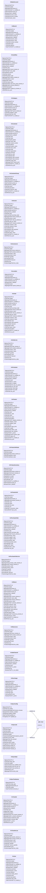

# Class diagram — `kiotviet`

29 model. Class có tiền tố `app_` là model thuộc app khác.

```mermaid
classDiagram
    direction LR
    class KvBankAccount {
    +BigAutoField PK id
    +CharField retailer
    +BigIntegerField kiotviet_id
    +DateTimeField? kv_modified_at
    +DateTimeField synced_at
    +BooleanField is_deleted
    +CharField account_name
    +CharField account_number
    +CharField bank_name
    }
    class KvBranch {
    +BigAutoField PK id
    +CharField retailer
    +BigIntegerField kiotviet_id
    +DateTimeField? kv_modified_at
    +DateTimeField synced_at
    +BooleanField is_deleted
    +CharField branch_name
    +CharField branch_code
    +CharField contact_number
    +CharField email
    +TextField address
    +DateTimeField? kv_created_at
    }
    class KvCashflow {
    +BigAutoField PK id
    +CharField retailer
    +BigIntegerField kiotviet_id
    +DateTimeField? kv_modified_at
    +DateTimeField synced_at
    +BooleanField is_deleted
    +CharField code
    +BigIntegerField? branch_kiotviet_id
    +DateTimeField? trans_date
    +DecimalField? amount
    +CharField method
    +CharField partner_type
    +BigIntegerField? partner_kiotviet_id
    +CharField partner_name
    +IntegerField? status
    +CharField status_value
    +BigIntegerField? cash_flow_group_kiotviet_id
    +BigIntegerField? account_kiotviet_id
    +TextField description
    +BigIntegerField? created_by_kiotviet_id
    +JSONField raw_json
    }
    class KvCategory {
    +BigAutoField PK id
    +CharField retailer
    +BigIntegerField kiotviet_id
    +DateTimeField? kv_modified_at
    +DateTimeField synced_at
    +BooleanField is_deleted
    +BigIntegerField? parent_kiotviet_id
    +CharField category_name
    +BooleanField has_child
    +DateTimeField? kv_created_at
    }
    class KvCustomer {
    +BigAutoField PK id
    +CharField retailer
    +BigIntegerField kiotviet_id
    +DateTimeField? kv_modified_at
    +DateTimeField synced_at
    +BooleanField is_deleted
    +CharField code
    +CharField name
    +BooleanField? gender
    +DateField? birth_date
    +CharField contact_number
    +TextField address
    +CharField location_name
    +CharField ward_name
    +CharField email
    +CharField organization
    +TextField comments
    +CharField tax_code
    +DecimalField? debt
    +DecimalField? total_invoiced
    +DecimalField? total_revenue
    +FloatField? total_point
    +BigIntegerField? reward_point
    +DateTimeField? kv_created_at
    +JSONField raw_json
    }
    class KvCustomerGroup {
    +BigAutoField PK id
    +CharField retailer
    +BigIntegerField kiotviet_id
    +DateTimeField? kv_modified_at
    +DateTimeField synced_at
    +BooleanField is_deleted
    +CharField name
    +TextField description
    +FloatField? discount_ratio
    +DateTimeField? kv_created_at
    +JSONField raw_json
    }
    class KvInvoice {
    +BigAutoField PK id
    +CharField retailer
    +BigIntegerField kiotviet_id
    +DateTimeField? kv_modified_at
    +DateTimeField synced_at
    +BooleanField is_deleted
    +CharField code
    +DateTimeField? purchase_date
    +BigIntegerField? branch_kiotviet_id
    +CharField branch_name
    +BigIntegerField? sold_by_kiotviet_id
    +CharField sold_by_name
    +BigIntegerField? customer_kiotviet_id
    +CharField customer_code
    +CharField customer_name
    +DecimalField? total
    +DecimalField? total_payment
    +IntegerField? status
    +CharField status_value
    +DateTimeField? kv_created_at
    +JSONField raw_json
    }
    class KvInvoiceLine {
    +BigAutoField PK id
    +CharField retailer
    +BigIntegerField invoice_kiotviet_id
    +BigIntegerField? product_kiotviet_id
    +CharField product_code
    +CharField product_name
    +FloatField? quantity
    +DecimalField? price
    +DecimalField? discount
    +TextField note
    +PositiveIntegerField line_index
    }
    class KvLocation {
    +BigAutoField PK id
    +CharField retailer
    +BigIntegerField kiotviet_id
    +DateTimeField? kv_modified_at
    +DateTimeField synced_at
    +BooleanField is_deleted
    +CharField name
    +BigIntegerField? parent_kiotviet_id
    }
    class KvOrder {
    +BigAutoField PK id
    +CharField retailer
    +BigIntegerField kiotviet_id
    +DateTimeField? kv_modified_at
    +DateTimeField synced_at
    +BooleanField is_deleted
    +CharField code
    +DateTimeField? purchase_date
    +BigIntegerField? branch_kiotviet_id
    +CharField branch_name
    +BigIntegerField? sold_by_kiotviet_id
    +CharField sold_by_name
    +BigIntegerField? customer_kiotviet_id
    +CharField customer_code
    +CharField customer_name
    +DecimalField? total
    +DecimalField? total_payment
    +DecimalField? discount
    +IntegerField? status
    +CharField status_value
    +TextField description
    +DateTimeField? kv_created_at
    +JSONField raw_json
    }
    class KvOrderLine {
    +BigAutoField PK id
    +CharField retailer
    +BigIntegerField order_kiotviet_id
    +BigIntegerField? product_kiotviet_id
    +CharField product_code
    +CharField product_name
    +FloatField? quantity
    +DecimalField? price
    +DecimalField? discount
    +TextField note
    +PositiveIntegerField line_index
    }
    class KvPricebook {
    +BigAutoField PK id
    +CharField retailer
    +BigIntegerField kiotviet_id
    +DateTimeField? kv_modified_at
    +DateTimeField synced_at
    +BooleanField is_deleted
    +CharField name
    +BooleanField? is_active
    +BooleanField? is_global
    +BooleanField? for_all_cus_group
    +BooleanField? for_all_user
    +DateTimeField? start_date
    +DateTimeField? end_date
    +JSONField raw_json
    }
    class KvProduct {
    +BigAutoField PK id
    +CharField retailer
    +BigIntegerField kiotviet_id
    +DateTimeField? kv_modified_at
    +DateTimeField synced_at
    +BooleanField is_deleted
    +CharField code
    +CharField bar_code
    +CharField name
    +CharField full_name
    +TextField description
    +BigIntegerField? category_kiotviet_id
    +CharField category_name
    +CharField category_path
    +CharField unit
    +DecimalField? base_price
    +FloatField? weight
    +BooleanField? allows_sale
    +BooleanField? has_variants
    +BooleanField? is_active
    +SmallIntegerField? product_type
    +JSONField image_urls
    +DateTimeField? kv_created_at
    +JSONField raw_json
    }
    class KvProductAttribute {
    +BigAutoField PK id
    +CharField retailer
    +BigIntegerField product_kiotviet_id
    +CharField attribute_name
    +CharField attribute_value
    }
    class KvProductInventory {
    +BigAutoField PK id
    +CharField retailer
    +BigIntegerField product_kiotviet_id
    +BigIntegerField branch_kiotviet_id
    +CharField branch_name
    +FloatField? on_hand
    +FloatField? reserved
    +DecimalField? cost
    +DateTimeField? kv_modified_at
    +DateTimeField synced_at
    +BooleanField is_deleted
    }
    class KvProductUnit {
    +BigAutoField PK id
    +CharField retailer
    +BigIntegerField kiotviet_id
    +BigIntegerField product_kiotviet_id
    +CharField code
    +CharField name
    +CharField full_name
    +CharField unit
    +FloatField? conversion_value
    +DecimalField? base_price
    }
    class KvPurchaseOrder {
    +BigAutoField PK id
    +CharField retailer
    +BigIntegerField kiotviet_id
    +DateTimeField? kv_modified_at
    +DateTimeField synced_at
    +BooleanField is_deleted
    +CharField code
    +DateTimeField? purchase_date
    +BigIntegerField? branch_kiotviet_id
    +CharField branch_name
    +CharField supplier_code
    +CharField supplier_name
    +CharField partner_type
    +CharField purchase_name
    +DecimalField? total
    +IntegerField? status
    +CharField status_value
    +JSONField raw_json
    }
    class KvPurchaseOrderLine {
    +BigAutoField PK id
    +CharField retailer
    +BigIntegerField purchase_order_kiotviet_id
    +BigIntegerField? product_kiotviet_id
    +CharField product_code
    +CharField product_name
    +FloatField? quantity
    +DecimalField? price
    +DecimalField? discount
    +PositiveIntegerField line_index
    }
    class KvReturn {
    +BigAutoField PK id
    +CharField retailer
    +BigIntegerField kiotviet_id
    +DateTimeField? kv_modified_at
    +DateTimeField synced_at
    +BooleanField is_deleted
    +CharField code
    +BigIntegerField? invoice_kiotviet_id
    +DateTimeField? return_date
    +BigIntegerField? branch_kiotviet_id
    +CharField branch_name
    +BigIntegerField? customer_kiotviet_id
    +CharField customer_code
    +CharField customer_name
    +DecimalField? return_total
    +DecimalField? total_payment
    +IntegerField? status
    +CharField status_value
    +BigIntegerField? received_by_kiotviet_id
    +CharField sold_by_name
    +DateTimeField? kv_created_at
    +JSONField raw_json
    }
    class KvReturnLine {
    +BigAutoField PK id
    +CharField retailer
    +BigIntegerField return_kiotviet_id
    +BigIntegerField? product_kiotviet_id
    +CharField product_code
    +CharField product_name
    +FloatField? quantity
    +DecimalField? price
    +TextField note
    +PositiveIntegerField line_index
    }
    class KvSaleChannel {
    +BigAutoField PK id
    +CharField retailer
    +BigIntegerField kiotviet_id
    +DateTimeField? kv_modified_at
    +DateTimeField synced_at
    +BooleanField is_deleted
    +CharField name
    +BooleanField? is_active
    +CharField img
    +BooleanField? is_not_delete
    }
    class KvSurcharge {
    +BigAutoField PK id
    +CharField retailer
    +BigIntegerField kiotviet_id
    +DateTimeField? kv_modified_at
    +DateTimeField synced_at
    +BooleanField is_deleted
    +CharField code
    +CharField name
    +DecimalField? price
    +BooleanField? is_active
    }
    class KvSyncConfig {
    +BigAutoField PK id
    +CharField UQ retailer
    +PositiveSmallIntegerField interval_minutes
    +BooleanField schedule_enabled
    +JSONField enabled_entities
    +DateTimeField updated_at
    +ForeignKey FK? updated_by
    }
    class KvSyncJob {
    +BigAutoField PK id
    +CharField trigger
    +CharField status
    +BooleanField full_sync
    +JSONField entities
    +PositiveSmallIntegerField progress_percent
    +CharField current_entity
    +BigIntegerField rows_synced
    +TextField message
    +JSONField entity_results
    +ForeignKey FK? started_by
    +DateTimeField created_at
    +DateTimeField? started_at
    +DateTimeField? finished_at
    }
    class KvSyncState {
    +BigAutoField PK id
    +CharField entity_type
    +CharField retailer
    +DateTimeField? last_modified_from
    +DateTimeField? last_full_sync_at
    +DateTimeField? last_success_at
    +TextField last_error
    +BigIntegerField records_total
    }
    class KvSyncTombstone {
    +BigAutoField PK id
    +CharField entity_type
    +BigIntegerField kiotviet_id
    +CharField retailer
    +DateTimeField removed_at
    }
    class KvTransfer {
    +BigAutoField PK id
    +CharField retailer
    +BigIntegerField kiotviet_id
    +DateTimeField? kv_modified_at
    +DateTimeField synced_at
    +BooleanField is_deleted
    +CharField code
    +IntegerField? status
    +TextField description
    +BigIntegerField? from_branch_kiotviet_id
    +BigIntegerField? to_branch_kiotviet_id
    +DateTimeField? transferred_date
    +DateTimeField? received_date
    +BooleanField? is_active
    +JSONField raw_json
    }
    class KvTransferLine {
    +BigAutoField PK id
    +CharField retailer
    +BigIntegerField transfer_kiotviet_id
    +BigIntegerField? product_kiotviet_id
    +CharField product_code
    +CharField product_name
    +FloatField? quantity
    +FloatField? receive_quantity
    +DecimalField? price
    +PositiveIntegerField line_index
    }
    class KvUser {
    +BigAutoField PK id
    +CharField retailer
    +BigIntegerField kiotviet_id
    +DateTimeField? kv_modified_at
    +DateTimeField synced_at
    +BooleanField is_deleted
    +CharField username
    +CharField given_name
    +TextField address
    +CharField mobile_phone
    +CharField email
    +TextField description
    +DateField? birth_date
    +DateTimeField? kv_created_at
    }

    class auth_User {
    +external
    }

    KvSyncConfig "*" --> "1" auth_User : updated_by
    KvSyncJob "*" --> "1" auth_User : started_by
```
