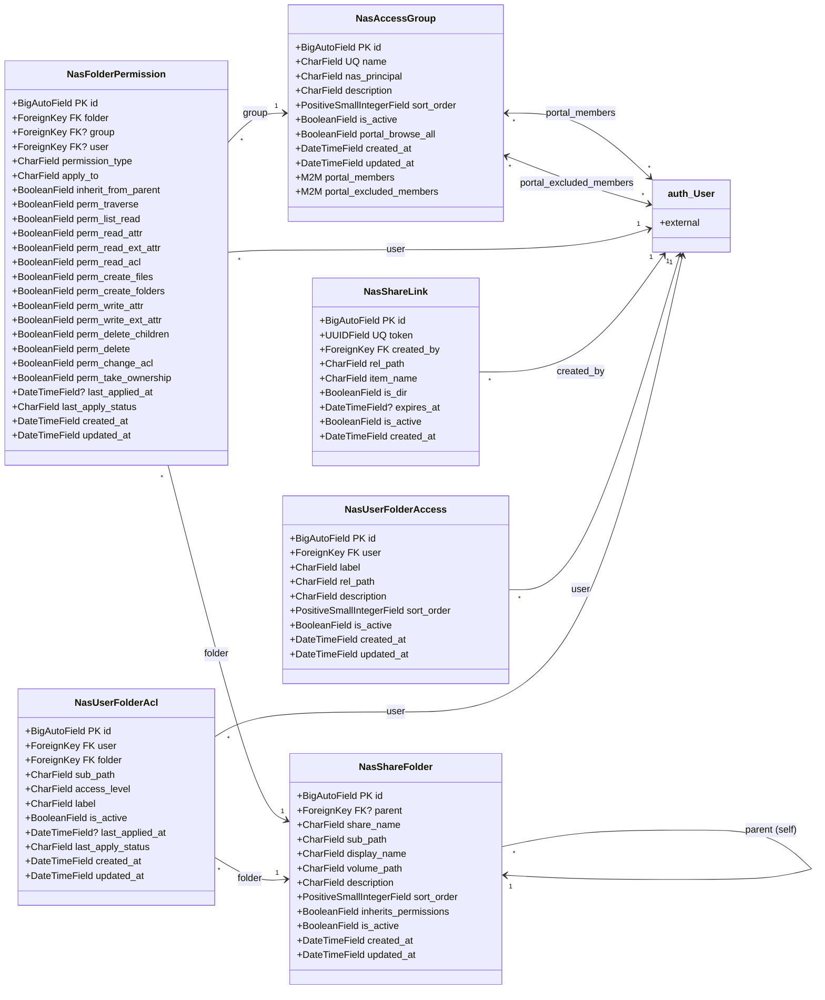

# Class diagram — `nas_storage`

6 model. Class có tiền tố `app_` là model thuộc app khác.

```mermaid
classDiagram
    direction LR
    class NasAccessGroup {
    +BigAutoField PK id
    +CharField UQ name
    +CharField nas_principal
    +CharField description
    +PositiveSmallIntegerField sort_order
    +BooleanField is_active
    +BooleanField portal_browse_all
    +DateTimeField created_at
    +DateTimeField updated_at
    +M2M portal_members
    +M2M portal_excluded_members
    }
    class NasFolderPermission {
    +BigAutoField PK id
    +ForeignKey FK folder
    +ForeignKey FK? group
    +ForeignKey FK? user
    +CharField permission_type
    +CharField apply_to
    +BooleanField inherit_from_parent
    +BooleanField perm_traverse
    +BooleanField perm_list_read
    +BooleanField perm_read_attr
    +BooleanField perm_read_ext_attr
    +BooleanField perm_read_acl
    +BooleanField perm_create_files
    +BooleanField perm_create_folders
    +BooleanField perm_write_attr
    +BooleanField perm_write_ext_attr
    +BooleanField perm_delete_children
    +BooleanField perm_delete
    +BooleanField perm_change_acl
    +BooleanField perm_take_ownership
    +DateTimeField? last_applied_at
    +CharField last_apply_status
    +DateTimeField created_at
    +DateTimeField updated_at
    }
    class NasShareFolder {
    +BigAutoField PK id
    +ForeignKey FK? parent
    +CharField share_name
    +CharField sub_path
    +CharField display_name
    +CharField volume_path
    +CharField description
    +PositiveSmallIntegerField sort_order
    +BooleanField inherits_permissions
    +BooleanField is_active
    +DateTimeField created_at
    +DateTimeField updated_at
    }
    class NasShareLink {
    +BigAutoField PK id
    +UUIDField UQ token
    +ForeignKey FK created_by
    +CharField rel_path
    +CharField item_name
    +BooleanField is_dir
    +DateTimeField? expires_at
    +BooleanField is_active
    +DateTimeField created_at
    }
    class NasUserFolderAccess {
    +BigAutoField PK id
    +ForeignKey FK user
    +CharField label
    +CharField rel_path
    +CharField description
    +PositiveSmallIntegerField sort_order
    +BooleanField is_active
    +DateTimeField created_at
    +DateTimeField updated_at
    }
    class NasUserFolderAcl {
    +BigAutoField PK id
    +ForeignKey FK user
    +ForeignKey FK folder
    +CharField sub_path
    +CharField access_level
    +CharField label
    +BooleanField is_active
    +DateTimeField? last_applied_at
    +CharField last_apply_status
    +DateTimeField created_at
    +DateTimeField updated_at
    }

    class auth_User {
    +external
    }

    NasAccessGroup "*" <--> "*" auth_User : portal_members
    NasAccessGroup "*" <--> "*" auth_User : portal_excluded_members
    NasFolderPermission "*" --> "1" NasShareFolder : folder
    NasFolderPermission "*" --> "1" NasAccessGroup : group
    NasFolderPermission "*" --> "1" auth_User : user
    NasShareFolder "*" --> "1" NasShareFolder : parent (self)
    NasShareLink "*" --> "1" auth_User : created_by
    NasUserFolderAccess "*" --> "1" auth_User : user
    NasUserFolderAcl "*" --> "1" auth_User : user
    NasUserFolderAcl "*" --> "1" NasShareFolder : folder
```
