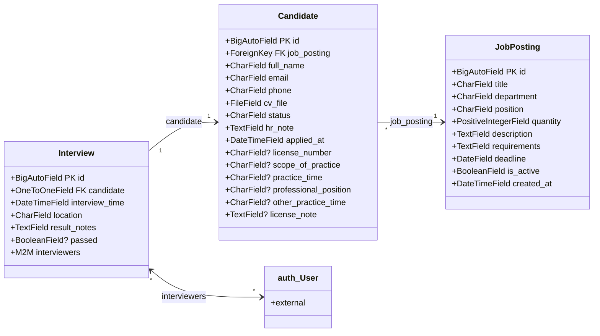

# Class diagram — `recruitment`

3 model. Class có tiền tố `app_` là model thuộc app khác.

```mermaid
classDiagram
    direction LR
    class Candidate {
    +BigAutoField PK id
    +ForeignKey FK job_posting
    +CharField full_name
    +CharField email
    +CharField phone
    +FileField cv_file
    +CharField status
    +TextField hr_note
    +DateTimeField applied_at
    +CharField? license_number
    +CharField? scope_of_practice
    +CharField? practice_time
    +CharField? professional_position
    +CharField? other_practice_time
    +TextField? license_note
    }
    class Interview {
    +BigAutoField PK id
    +OneToOneField FK candidate
    +DateTimeField interview_time
    +CharField location
    +TextField result_notes
    +BooleanField? passed
    +M2M interviewers
    }
    class JobPosting {
    +BigAutoField PK id
    +CharField title
    +CharField department
    +CharField position
    +PositiveIntegerField quantity
    +TextField description
    +TextField requirements
    +DateField deadline
    +BooleanField is_active
    +DateTimeField created_at
    }

    class auth_User {
    +external
    }

    Candidate "*" --> "1" JobPosting : job_posting
    Interview "1" --> "1" Candidate : candidate
    Interview "*" <--> "*" auth_User : interviewers
```
