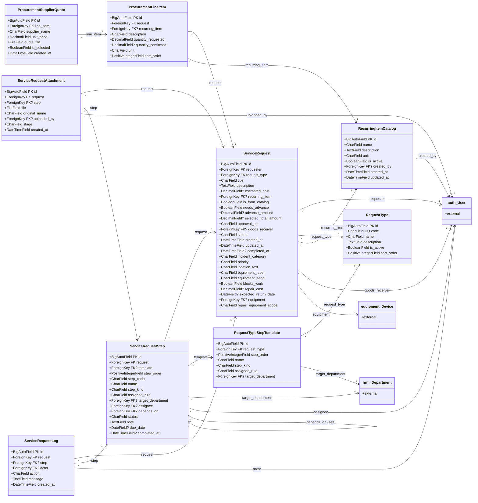

# Class diagram — `service_requests`

9 model. Class có tiền tố `app_` là model thuộc app khác.

```mermaid
classDiagram
    direction LR
    class ProcurementLineItem {
    +BigAutoField PK id
    +ForeignKey FK request
    +ForeignKey FK? recurring_item
    +CharField description
    +DecimalField quantity_requested
    +DecimalField? quantity_confirmed
    +CharField unit
    +PositiveIntegerField sort_order
    }
    class ProcurementSupplierQuote {
    +BigAutoField PK id
    +ForeignKey FK line_item
    +CharField supplier_name
    +DecimalField unit_price
    +FileField quote_file
    +BooleanField is_selected
    +DateTimeField created_at
    }
    class RecurringItemCatalog {
    +BigAutoField PK id
    +CharField name
    +TextField description
    +CharField unit
    +BooleanField is_active
    +ForeignKey FK? created_by
    +DateTimeField created_at
    +DateTimeField updated_at
    }
    class RequestType {
    +BigAutoField PK id
    +CharField UQ code
    +CharField name
    +TextField description
    +BooleanField is_active
    +PositiveIntegerField sort_order
    }
    class RequestTypeStepTemplate {
    +BigAutoField PK id
    +ForeignKey FK request_type
    +PositiveIntegerField step_order
    +CharField name
    +CharField step_kind
    +CharField assignee_rule
    +ForeignKey FK? target_department
    }
    class ServiceRequest {
    +BigAutoField PK id
    +ForeignKey FK requester
    +ForeignKey FK request_type
    +CharField title
    +TextField description
    +DecimalField? estimated_cost
    +ForeignKey FK? recurring_item
    +BooleanField is_from_catalog
    +BooleanField needs_advance
    +DecimalField? advance_amount
    +DecimalField? selected_total_amount
    +CharField approval_tier
    +ForeignKey FK? goods_receiver
    +CharField status
    +DateTimeField created_at
    +DateTimeField updated_at
    +DateTimeField? completed_at
    +CharField incident_category
    +CharField priority
    +CharField location_text
    +CharField equipment_label
    +CharField equipment_serial
    +BooleanField blocks_work
    +DecimalField? repair_cost
    +DateField? expected_return_date
    +ForeignKey FK? equipment
    +CharField repair_equipment_scope
    }
    class ServiceRequestAttachment {
    +BigAutoField PK id
    +ForeignKey FK request
    +ForeignKey FK? step
    +FileField file
    +CharField original_name
    +ForeignKey FK? uploaded_by
    +CharField stage
    +DateTimeField created_at
    }
    class ServiceRequestLog {
    +BigAutoField PK id
    +ForeignKey FK request
    +ForeignKey FK? step
    +ForeignKey FK? actor
    +CharField action
    +TextField message
    +DateTimeField created_at
    }
    class ServiceRequestStep {
    +BigAutoField PK id
    +ForeignKey FK request
    +ForeignKey FK? template
    +PositiveIntegerField step_order
    +CharField step_code
    +CharField name
    +CharField step_kind
    +CharField assignee_rule
    +ForeignKey FK? target_department
    +ForeignKey FK? assignee
    +ForeignKey FK? depends_on
    +CharField status
    +TextField note
    +DateField? due_date
    +DateTimeField? completed_at
    }

    class auth_User {
    +external
    }
    class equipment_Device {
    +external
    }
    class hrm_Department {
    +external
    }

    ProcurementLineItem "*" --> "1" ServiceRequest : request
    ProcurementLineItem "*" --> "1" RecurringItemCatalog : recurring_item
    ProcurementSupplierQuote "*" --> "1" ProcurementLineItem : line_item
    RecurringItemCatalog "*" --> "1" auth_User : created_by
    RequestTypeStepTemplate "*" --> "1" RequestType : request_type
    RequestTypeStepTemplate "*" --> "1" hrm_Department : target_department
    ServiceRequest "*" --> "1" auth_User : requester
    ServiceRequest "*" --> "1" RequestType : request_type
    ServiceRequest "*" --> "1" RecurringItemCatalog : recurring_item
    ServiceRequest "*" --> "1" auth_User : goods_receiver
    ServiceRequest "*" --> "1" equipment_Device : equipment
    ServiceRequestAttachment "*" --> "1" ServiceRequest : request
    ServiceRequestAttachment "*" --> "1" ServiceRequestStep : step
    ServiceRequestAttachment "*" --> "1" auth_User : uploaded_by
    ServiceRequestLog "*" --> "1" ServiceRequest : request
    ServiceRequestLog "*" --> "1" ServiceRequestStep : step
    ServiceRequestLog "*" --> "1" auth_User : actor
    ServiceRequestStep "*" --> "1" ServiceRequest : request
    ServiceRequestStep "*" --> "1" RequestTypeStepTemplate : template
    ServiceRequestStep "*" --> "1" hrm_Department : target_department
    ServiceRequestStep "*" --> "1" auth_User : assignee
    ServiceRequestStep "*" --> "1" ServiceRequestStep : depends_on (self)
```
