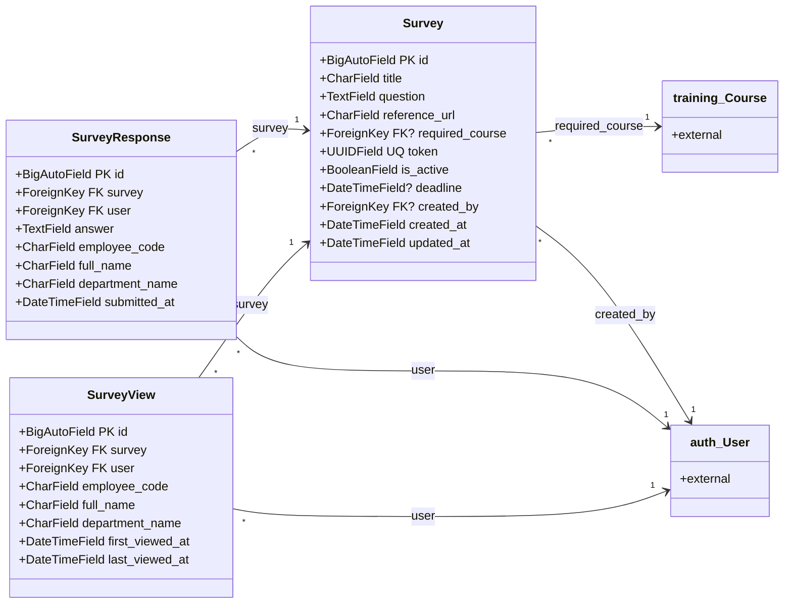

# Class diagram — `surveys`

3 model. Class có tiền tố `app_` là model thuộc app khác.

```mermaid
classDiagram
    direction LR
    class Survey {
    +BigAutoField PK id
    +CharField title
    +TextField question
    +CharField reference_url
    +ForeignKey FK? required_course
    +UUIDField UQ token
    +BooleanField is_active
    +DateTimeField? deadline
    +ForeignKey FK? created_by
    +DateTimeField created_at
    +DateTimeField updated_at
    }
    class SurveyResponse {
    +BigAutoField PK id
    +ForeignKey FK survey
    +ForeignKey FK user
    +TextField answer
    +CharField employee_code
    +CharField full_name
    +CharField department_name
    +DateTimeField submitted_at
    }
    class SurveyView {
    +BigAutoField PK id
    +ForeignKey FK survey
    +ForeignKey FK user
    +CharField employee_code
    +CharField full_name
    +CharField department_name
    +DateTimeField first_viewed_at
    +DateTimeField last_viewed_at
    }

    class auth_User {
    +external
    }
    class training_Course {
    +external
    }

    Survey "*" --> "1" training_Course : required_course
    Survey "*" --> "1" auth_User : created_by
    SurveyResponse "*" --> "1" Survey : survey
    SurveyResponse "*" --> "1" auth_User : user
    SurveyView "*" --> "1" Survey : survey
    SurveyView "*" --> "1" auth_User : user
```
