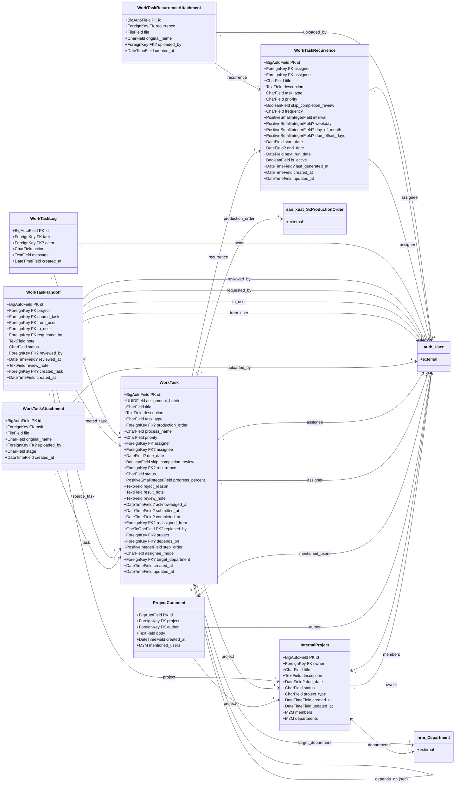

# Class diagram — `tasks`

8 model. Class có tiền tố `app_` là model thuộc app khác.

```mermaid
classDiagram
    direction LR
    class InternalProject {
    +BigAutoField PK id
    +ForeignKey FK owner
    +CharField title
    +TextField description
    +DateField? due_date
    +CharField status
    +CharField project_type
    +DateTimeField created_at
    +DateTimeField updated_at
    +M2M members
    +M2M departments
    }
    class ProjectComment {
    +BigAutoField PK id
    +ForeignKey FK project
    +ForeignKey FK author
    +TextField body
    +DateTimeField created_at
    +M2M mentioned_users
    }
    class WorkTask {
    +BigAutoField PK id
    +UUIDField assignment_batch
    +CharField title
    +TextField description
    +CharField task_type
    +ForeignKey FK? production_order
    +CharField process_name
    +CharField priority
    +ForeignKey FK assigner
    +ForeignKey FK? assignee
    +DateField? due_date
    +BooleanField skip_completion_review
    +ForeignKey FK? recurrence
    +CharField status
    +PositiveSmallIntegerField progress_percent
    +TextField reject_reason
    +TextField result_note
    +TextField review_note
    +DateTimeField? acknowledged_at
    +DateTimeField? submitted_at
    +DateTimeField? completed_at
    +ForeignKey FK? reassigned_from
    +OneToOneField FK? replaced_by
    +ForeignKey FK? project
    +ForeignKey FK? depends_on
    +PositiveIntegerField step_order
    +CharField assignee_mode
    +ForeignKey FK? target_department
    +DateTimeField created_at
    +DateTimeField updated_at
    }
    class WorkTaskAttachment {
    +BigAutoField PK id
    +ForeignKey FK task
    +FileField file
    +CharField original_name
    +ForeignKey FK? uploaded_by
    +CharField stage
    +DateTimeField created_at
    }
    class WorkTaskHandoff {
    +BigAutoField PK id
    +ForeignKey FK project
    +ForeignKey FK source_task
    +ForeignKey FK from_user
    +ForeignKey FK to_user
    +ForeignKey FK requested_by
    +TextField note
    +CharField status
    +ForeignKey FK? reviewed_by
    +DateTimeField? reviewed_at
    +TextField review_note
    +ForeignKey FK? created_task
    +DateTimeField created_at
    }
    class WorkTaskLog {
    +BigAutoField PK id
    +ForeignKey FK task
    +ForeignKey FK? actor
    +CharField action
    +TextField message
    +DateTimeField created_at
    }
    class WorkTaskRecurrence {
    +BigAutoField PK id
    +ForeignKey FK assigner
    +ForeignKey FK assignee
    +CharField title
    +TextField description
    +CharField task_type
    +CharField priority
    +BooleanField skip_completion_review
    +CharField frequency
    +PositiveSmallIntegerField interval
    +PositiveSmallIntegerField? weekday
    +PositiveSmallIntegerField? day_of_month
    +PositiveSmallIntegerField? due_offset_days
    +DateField start_date
    +DateField? end_date
    +DateField next_run_date
    +BooleanField is_active
    +DateTimeField? last_generated_at
    +DateTimeField created_at
    +DateTimeField updated_at
    }
    class WorkTaskRecurrenceAttachment {
    +BigAutoField PK id
    +ForeignKey FK recurrence
    +FileField file
    +CharField original_name
    +ForeignKey FK? uploaded_by
    +DateTimeField created_at
    }

    class auth_User {
    +external
    }
    class hrm_Department {
    +external
    }
    class san_xuat_SxProductionOrder {
    +external
    }

    InternalProject "*" --> "1" auth_User : owner
    InternalProject "*" <--> "*" auth_User : members
    InternalProject "*" <--> "*" hrm_Department : departments
    ProjectComment "*" --> "1" InternalProject : project
    ProjectComment "*" --> "1" auth_User : author
    ProjectComment "*" <--> "*" auth_User : mentioned_users
    WorkTask "*" --> "1" san_xuat_SxProductionOrder : production_order
    WorkTask "*" --> "1" auth_User : assigner
    WorkTask "*" --> "1" auth_User : assignee
    WorkTask "*" --> "1" WorkTaskRecurrence : recurrence
    WorkTask "*" --> "1" WorkTask : reassigned_from (self)
    WorkTask "1" --> "1" WorkTask : replaced_by (self)
    WorkTask "*" --> "1" InternalProject : project
    WorkTask "*" --> "1" WorkTask : depends_on (self)
    WorkTask "*" --> "1" hrm_Department : target_department
    WorkTaskAttachment "*" --> "1" WorkTask : task
    WorkTaskAttachment "*" --> "1" auth_User : uploaded_by
    WorkTaskHandoff "*" --> "1" InternalProject : project
    WorkTaskHandoff "*" --> "1" WorkTask : source_task
    WorkTaskHandoff "*" --> "1" auth_User : from_user
    WorkTaskHandoff "*" --> "1" auth_User : to_user
    WorkTaskHandoff "*" --> "1" auth_User : requested_by
    WorkTaskHandoff "*" --> "1" auth_User : reviewed_by
    WorkTaskHandoff "*" --> "1" WorkTask : created_task
    WorkTaskLog "*" --> "1" WorkTask : task
    WorkTaskLog "*" --> "1" auth_User : actor
    WorkTaskRecurrence "*" --> "1" auth_User : assigner
    WorkTaskRecurrence "*" --> "1" auth_User : assignee
    WorkTaskRecurrenceAttachment "*" --> "1" WorkTaskRecurrence : recurrence
    WorkTaskRecurrenceAttachment "*" --> "1" auth_User : uploaded_by
```
