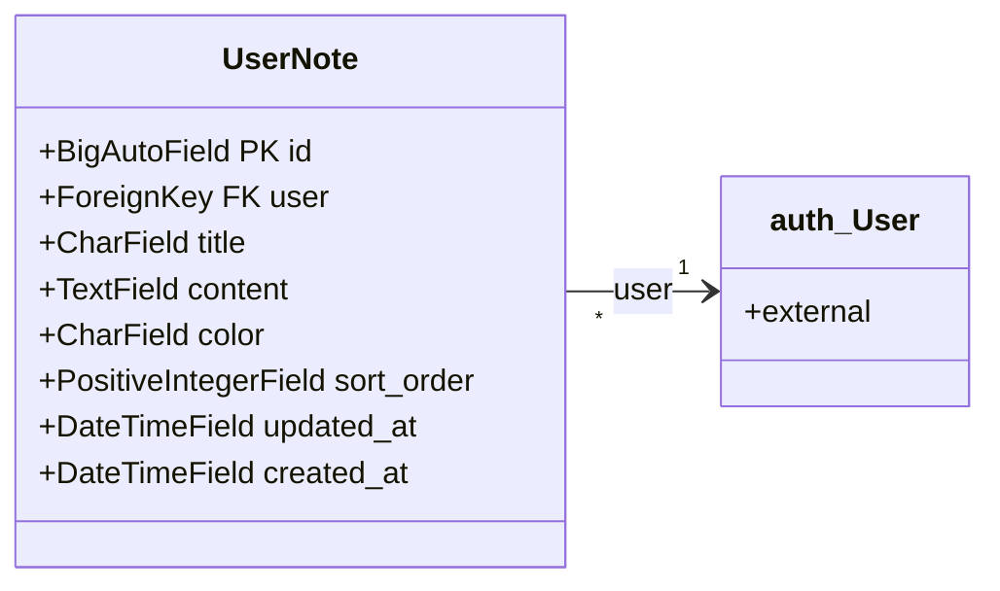

# Class diagram — `tools`

1 model. Class có tiền tố `app_` là model thuộc app khác.

```mermaid
classDiagram
    direction LR
    class UserNote {
    +BigAutoField PK id
    +ForeignKey FK user
    +CharField title
    +TextField content
    +CharField color
    +PositiveIntegerField sort_order
    +DateTimeField updated_at
    +DateTimeField created_at
    }

    class auth_User {
    +external
    }

    UserNote "*" --> "1" auth_User : user
```
