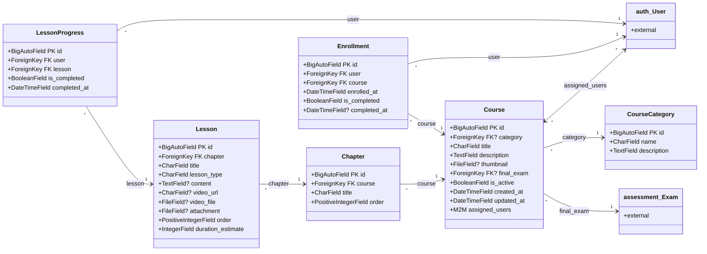

# Class diagram — `training`

6 model. Class có tiền tố `app_` là model thuộc app khác.

```mermaid
classDiagram
    direction LR
    class Chapter {
    +BigAutoField PK id
    +ForeignKey FK course
    +CharField title
    +PositiveIntegerField order
    }
    class Course {
    +BigAutoField PK id
    +ForeignKey FK? category
    +CharField title
    +TextField description
    +FileField? thumbnail
    +ForeignKey FK? final_exam
    +BooleanField is_active
    +DateTimeField created_at
    +DateTimeField updated_at
    +M2M assigned_users
    }
    class CourseCategory {
    +BigAutoField PK id
    +CharField name
    +TextField description
    }
    class Enrollment {
    +BigAutoField PK id
    +ForeignKey FK user
    +ForeignKey FK course
    +DateTimeField enrolled_at
    +BooleanField is_completed
    +DateTimeField? completed_at
    }
    class Lesson {
    +BigAutoField PK id
    +ForeignKey FK chapter
    +CharField title
    +CharField lesson_type
    +TextField? content
    +CharField? video_url
    +FileField? video_file
    +FileField? attachment
    +PositiveIntegerField order
    +IntegerField duration_estimate
    }
    class LessonProgress {
    +BigAutoField PK id
    +ForeignKey FK user
    +ForeignKey FK lesson
    +BooleanField is_completed
    +DateTimeField completed_at
    }

    class assessment_Exam {
    +external
    }
    class auth_User {
    +external
    }

    Chapter "*" --> "1" Course : course
    Course "*" --> "1" CourseCategory : category
    Course "*" --> "1" assessment_Exam : final_exam
    Course "*" <--> "*" auth_User : assigned_users
    Enrollment "*" --> "1" auth_User : user
    Enrollment "*" --> "1" Course : course
    Lesson "*" --> "1" Chapter : chapter
    LessonProgress "*" --> "1" auth_User : user
    LessonProgress "*" --> "1" Lesson : lesson
```
