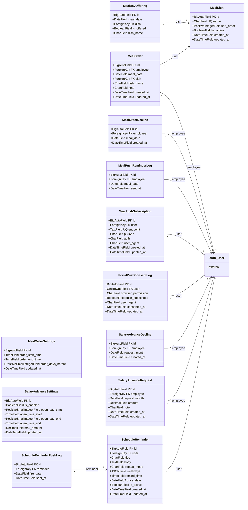

# Class diagram — `utilities`

13 model. Class có tiền tố `app_` là model thuộc app khác.

```mermaid
classDiagram
    direction LR
    class MealDayOffering {
    +BigAutoField PK id
    +DateField meal_date
    +ForeignKey FK dish
    +BooleanField is_offered
    +CharField dish_name
    }
    class MealDish {
    +BigAutoField PK id
    +CharField UQ name
    +PositiveIntegerField sort_order
    +BooleanField is_active
    +DateTimeField created_at
    +DateTimeField updated_at
    }
    class MealOrder {
    +BigAutoField PK id
    +ForeignKey FK employee
    +DateField meal_date
    +ForeignKey FK dish
    +CharField dish_name
    +CharField note
    +DateTimeField created_at
    +DateTimeField updated_at
    }
    class MealOrderDecline {
    +BigAutoField PK id
    +ForeignKey FK employee
    +DateField meal_date
    +DateTimeField created_at
    }
    class MealOrderSettings {
    +BigAutoField PK id
    +TimeField order_start_time
    +TimeField order_end_time
    +PositiveSmallIntegerField order_days_before
    +DateTimeField updated_at
    }
    class MealPushReminderLog {
    +BigAutoField PK id
    +ForeignKey FK employee
    +DateField meal_date
    +DateTimeField sent_at
    }
    class MealPushSubscription {
    +BigAutoField PK id
    +ForeignKey FK user
    +TextField UQ endpoint
    +CharField p256dh
    +CharField auth
    +CharField user_agent
    +DateTimeField created_at
    +DateTimeField updated_at
    }
    class PortalPushConsentLog {
    +BigAutoField PK id
    +OneToOneField FK user
    +CharField browser_permission
    +BooleanField push_subscribed
    +CharField user_agent
    +DateTimeField consented_at
    +DateTimeField updated_at
    }
    class SalaryAdvanceDecline {
    +BigAutoField PK id
    +ForeignKey FK employee
    +DateField request_month
    +DateTimeField created_at
    }
    class SalaryAdvanceRequest {
    +BigAutoField PK id
    +ForeignKey FK employee
    +DateField request_month
    +DecimalField amount
    +CharField note
    +DateTimeField created_at
    +DateTimeField updated_at
    }
    class SalaryAdvanceSettings {
    +BigAutoField PK id
    +BooleanField is_enabled
    +PositiveSmallIntegerField open_day_start
    +TimeField open_time_start
    +PositiveSmallIntegerField open_day_end
    +TimeField open_time_end
    +DecimalField max_amount
    +DateTimeField updated_at
    }
    class ScheduleReminder {
    +BigAutoField PK id
    +ForeignKey FK user
    +CharField title
    +TextField body
    +CharField repeat_mode
    +JSONField weekdays
    +TimeField remind_time
    +DateField? once_date
    +BooleanField is_active
    +DateTimeField created_at
    +DateTimeField updated_at
    }
    class ScheduleReminderPushLog {
    +BigAutoField PK id
    +ForeignKey FK reminder
    +DateField fire_date
    +DateTimeField sent_at
    }

    class auth_User {
    +external
    }

    MealDayOffering "*" --> "1" MealDish : dish
    MealOrder "*" --> "1" auth_User : employee
    MealOrder "*" --> "1" MealDish : dish
    MealOrderDecline "*" --> "1" auth_User : employee
    MealPushReminderLog "*" --> "1" auth_User : employee
    MealPushSubscription "*" --> "1" auth_User : user
    PortalPushConsentLog "1" --> "1" auth_User : user
    SalaryAdvanceDecline "*" --> "1" auth_User : employee
    SalaryAdvanceRequest "*" --> "1" auth_User : employee
    ScheduleReminder "*" --> "1" auth_User : user
    ScheduleReminderPushLog "*" --> "1" ScheduleReminder : reminder
```
