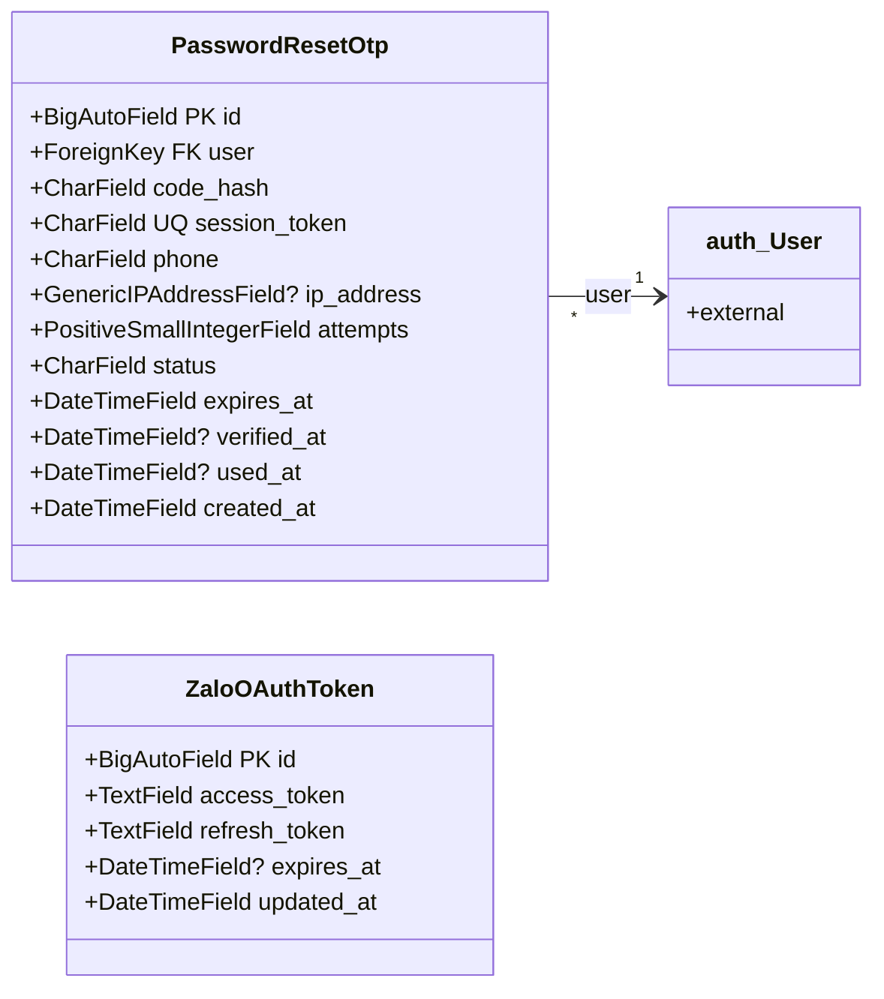

# Class diagram — `zalo`

2 model. Class có tiền tố `app_` là model thuộc app khác.

```mermaid
classDiagram
    direction LR
    class PasswordResetOtp {
    +BigAutoField PK id
    +ForeignKey FK user
    +CharField code_hash
    +CharField UQ session_token
    +CharField phone
    +GenericIPAddressField? ip_address
    +PositiveSmallIntegerField attempts
    +CharField status
    +DateTimeField expires_at
    +DateTimeField? verified_at
    +DateTimeField? used_at
    +DateTimeField created_at
    }
    class ZaloOAuthToken {
    +BigAutoField PK id
    +TextField access_token
    +TextField refresh_token
    +DateTimeField? expires_at
    +DateTimeField updated_at
    }

    class auth_User {
    +external
    }

    PasswordResetOtp "*" --> "1" auth_User : user
```
