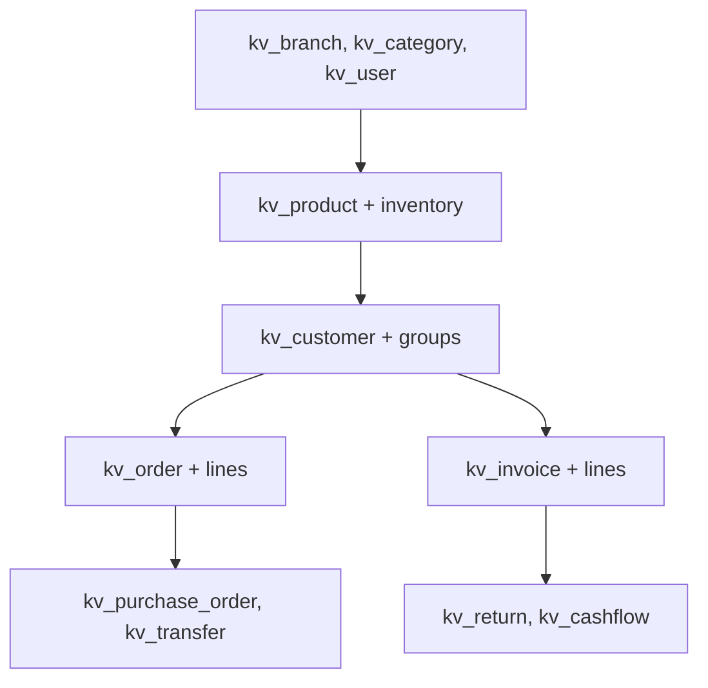
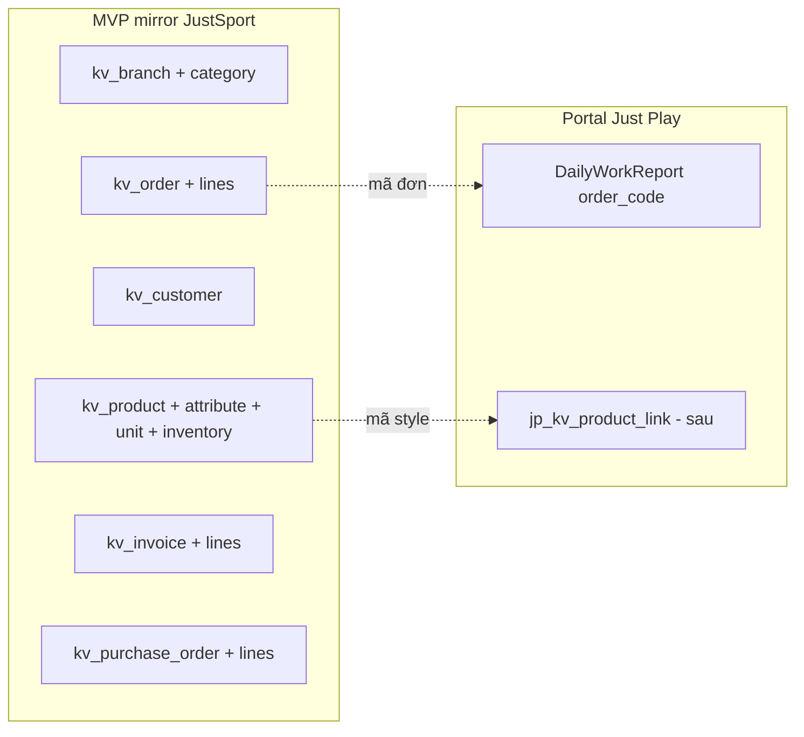

# Thiết kế schema mirror KiotViet (PostgreSQL portal)

Nguồn: Public API **Ver 4.0** — `api-reference-full.txt`, `TOC.md`, `endpoints-index.md`.

**Mục tiêu:** Bản sao logic dữ liệu API (không clone DB nội bộ KiotViet).  
**Quy ước:** Bảng prefix `kv_`, khóa ngoại KiotViet = `kiotviet_id` (BIGINT), thời gian = `timestamptz`, tiền = `numeric(18,2)`.

---

## 1. Nguyên tắc thiết kế

| Quy tắc | Giải thích |
|---------|------------|
| **1 entity API = 1 bảng header** | `orders`, `invoices`, `purchaseorders`… |
| **Mảng lồng = bảng con** | `orderDetails` → `kv_order_line`, `inventories` → `kv_product_inventory` |
| **Cấu trúc sâu / hiếm dùng** | Lưu thêm `raw_json` (JSONB) trên header hoặc dòng |
| **Sync** | Mọi bảng chính có `kv_modified_at`, `synced_at`, `is_deleted` |
| **Gian hàng** | `retailer` (varchar, mặc định `justsport`) — multi-tenant sau này |
| **Không map 1:1 tên field API** | API camelCase → DB snake_case |

### Bảng meta (bắt buộc cho mirror)

```
kv_sync_state
├── entity_type      varchar(32) PK   # products, customers, orders...
├── retailer         varchar(64) PK
├── last_modified_from timestamptz     # cursor incremental
├── last_full_sync_at  timestamptz
├── last_success_at    timestamptz
├── last_error         text
└── records_total      bigint

kv_sync_tombstone
├── entity_type      varchar(32)
├── kiotviet_id      bigint
├── retailer         varchar(64)
├── removed_at       timestamptz
└── UNIQUE(entity_type, kiotviet_id, retailer)
```

`removeId` / `removedIds` từ API → insert `kv_sync_tombstone` + `is_deleted=true` trên bảng tương ứng.

---

## 2. Sơ đồ quan hệ (tổng quan)

```mermaid
erDiagram
    kv_branch ||--o{ kv_product_inventory : branch
    kv_branch ||--o{ kv_order : branch
    kv_branch ||--o{ kv_invoice : branch
    kv_branch ||--o{ kv_purchase_order : branch
    kv_branch ||--o{ kv_transfer : from_to

    kv_category ||--o{ kv_product : category
    kv_product ||--o{ kv_product_inventory : stock
    kv_product ||--o{ kv_product_attribute : has
    kv_product ||--o{ kv_product_unit : units
    kv_product ||--o{ kv_product_pricebook : price
    kv_product ||--o{ kv_order_line : line
    kv_product ||--o{ kv_invoice_line : line

    kv_customer ||--o{ kv_order : places
    kv_customer ||--o{ kv_invoice : buys
    kv_customer }o--o{ kv_customer_group : member

    kv_order ||--|{ kv_order_line : contains
    kv_order ||--o| kv_order_delivery : delivery
    kv_order ||--o{ kv_payment : payments

    kv_invoice ||--|{ kv_invoice_line : contains
    kv_invoice ||--o| kv_invoice_delivery : delivery
    kv_invoice ||--o{ kv_payment : payments
    kv_invoice ||--o{ kv_return : returned

    kv_purchase_order ||--|{ kv_purchase_order_line : contains

    kv_transfer ||--|{ kv_transfer_line : contains

    kv_pricebook ||--o{ kv_product_pricebook : applies

    kv_user ||--o{ kv_order : sold_by
    kv_sale_channel ||--o{ kv_order : channel
```



---

## 3. Danh mục & master data

### `kv_branch` — API `GET /branches`

| Cột | Kiểu | API field | Ghi chú |
|-----|------|-----------|---------|
| id | bigserial PK | — | PK nội bộ portal |
| kiotviet_id | int UNIQUE | id | |
| retailer | varchar(64) | retailerId | |
| branch_name | varchar(255) | branchName | |
| branch_code | varchar(64) | branchCode | |
| contact_number | varchar(32) | contactNumber | |
| email | varchar(255) | email | |
| address | text | address | |
| kv_created_at | timestamptz | createdDate | |
| kv_modified_at | timestamptz | modifiedDate | |
| synced_at | timestamptz | — | |
| is_deleted | boolean | removedIds | default false |

### `kv_category` — API `GET /categories`

| Cột | Kiểu | API field |
|-----|------|-----------|
| kiotviet_id | int UNIQUE | categoryId |
| parent_kiotviet_id | int NULL | parentId |
| category_name | varchar(255) | categoryName |
| retailer | varchar(64) | retailerId |
| has_child | boolean | hasChild |
| kv_created_at | timestamptz | createdDate |
| kv_modified_at | timestamptz | modifiedDate |
| synced_at, is_deleted | | |

> Cây 3 cấp: sync `hierachicalData=true` lần đầu, sau đó incremental `lastModifiedFrom`.

### `kv_user` — API `GET /users`

| Cột | Kiểu | API field |
|-----|------|-----------|
| kiotviet_id | bigint UNIQUE | id |
| username | varchar(150) | userName |
| given_name | varchar(255) | givenName |
| address | text | address |
| mobile_phone | varchar(32) | mobilePhone |
| email | varchar(255) | email |
| description | text | description |
| birth_date | date | birthDate |
| retailer | varchar(64) | retailerId |
| kv_created_at | timestamptz | createdDate |
| synced_at, is_deleted | | |

### `kv_sale_channel` — API `GET /salechannel`

| Cột | Kiểu | API field |
|-----|------|-----------|
| kiotviet_id | int UNIQUE | id |
| name | varchar(255) | name |
| is_active | boolean | isActive |
| img | varchar(500) | img |
| is_not_delete | boolean | isNotDelete |
| synced_at, is_deleted | | |

### `kv_bank_account` — API `GET /BankAccounts`

| Cột | Kiểu | API field |
|-----|------|-----------|
| kiotviet_id | int UNIQUE | id |
| account_name | varchar(255) | accountName |
| account_number | varchar(64) | account |
| bank_name | varchar(255) | bank |
| retailer | varchar(64) | retailerId |
| kv_modified_at | timestamptz | modifiedDate |
| synced_at, is_deleted | | |

### `kv_location` — API `GET /locations`

| Cột | Kiểu | API field |
|-----|------|-----------|
| kiotviet_id | int UNIQUE | id |
| name | varchar(255) | name |
| parent_kiotviet_id | int | parentId |
| synced_at | timestamptz | |

### `kv_surcharge` — API `GET /surchages`

| Cột | Kiểu | API field |
|-----|------|-----------|
| kiotviet_id | int UNIQUE | id |
| code | varchar(64) | code |
| name | varchar(255) | name |
| price | numeric(18,2) | price |
| is_active | boolean | isActive |
| synced_at, is_deleted | | |

---

## 4. Hàng hóa & tồn kho

### `kv_product` — API `GET /products`, `GET /products/{id}`

| Cột | Kiểu | API field | Ghi chú |
|-----|------|-----------|---------|
| kiotviet_id | bigint UNIQUE | id | |
| code | varchar(64) | code | index |
| bar_code | varchar(64) | barCode | index |
| name | varchar(500) | name | |
| full_name | varchar(500) | fullName | |
| description | text | description | |
| category_kiotviet_id | int FK→kv_category | categoryId | |
| category_name | varchar(255) | categoryName | denormalized |
| unit | varchar(32) | unit | |
| base_price | numeric(18,2) | basePrice | |
| weight | double precision | weight | |
| allows_sale | boolean | allowsSale | |
| has_variants | boolean | hasVariants | |
| is_active | boolean | isActive | |
| is_reward_point | boolean | isRewardPoint | |
| product_type | smallint | productType | 1=combo, 2=thường, 3=dịch vụ |
| master_unit_kiotviet_id | bigint | masterUnitId | |
| master_product_kiotviet_id | bigint | masterProductId | |
| conversion_value | double precision | conversionValue | |
| is_lot_serial_control | boolean | isLotSerialControl | IMEI |
| is_batch_expire_control | boolean | isBatchExpireControl | lô/date |
| order_template | text | orderTemplate | |
| retailer | varchar(64) | retailerId | |
| kv_created_at | timestamptz | createdDate | |
| kv_modified_at | timestamptz | modifiedDate | index |
| raw_json | jsonb | — | serials, batch, warranties khi cần |
| synced_at, is_deleted | | | |

### `kv_product_attribute` — nested `attributes[]`

| Cột | Kiểu | API field |
|-----|------|-----------|
| id | bigserial PK | |
| product_kiotviet_id | bigint FK | productId |
| attribute_name | varchar(255) | attributeName |
| attribute_value | varchar(255) | attributeValue |

### `kv_product_unit` — nested `units[]`

| Cột | Kiểu | API field |
|-----|------|-----------|
| kiotviet_id | bigint | id |
| product_kiotviet_id | bigint FK | (parent product) |
| code, name, full_name, unit | | |
| conversion_value | double | conversionValue |
| base_price | numeric(18,2) | basePrice |

### `kv_product_inventory` — `inventories[]` hoặc `GET /productOnHands`

| Cột | Kiểu | API field |
|-----|------|-----------|
| product_kiotviet_id | bigint FK | productId |
| branch_kiotviet_id | int FK | branchId |
| on_hand | double precision | onHand / onhand |
| reserved | double precision | reserved |
| cost | numeric(18,2) | cost |
| kv_modified_at | timestamptz | modifiedDate |
| UNIQUE(product_kiotviet_id, branch_kiotviet_id) | | |

### `kv_product_pricebook` — nested `priceBooks[]`

| Cột | Kiểu | API field |
|-----|------|-----------|
| product_kiotviet_id | bigint FK | productId |
| pricebook_kiotviet_id | bigint FK | priceBookId |
| pricebook_name | varchar(255) | priceBookName |
| price | numeric(18,2) | price |
| is_active | boolean | isActive |
| start_date, end_date | timestamptz | startDate, endDate |

### `kv_product_formula` — combo `productFormulas[]`

| Cột | Kiểu | API field |
|-----|------|-----------|
| combo_product_kiotviet_id | bigint FK | productId |
| material_kiotviet_id | bigint | materialId |
| material_code | varchar(64) | materialCode |
| material_name | varchar(255) | materialName |
| quantity | int | quantity |
| base_price | numeric(18,2) | basePrice |

### `kv_product_serial` — `productSerials[]` (khi `IncludeSerials=true`)

| Cột | Kiểu | API field |
|-----|------|-----------|
| product_kiotviet_id | bigint FK | productId |
| branch_kiotviet_id | int FK | branchId |
| serial_number | varchar(128) | serialNumber |
| status | smallint | status |
| quantity | double | quantity |

### `kv_product_batch` — `productBatchExpires[]`

| Cột | Kiểu | API field |
|-----|------|-----------|
| kiotviet_batch_id | bigint | id (lô) |
| product_kiotviet_id | bigint FK | productId |
| branch_kiotviet_id | int FK | branchId |
| batch_name | varchar(255) | batchName |
| full_name_virgule | varchar(500) | fullNameVirgule |
| on_hand | double | onHand |
| expire_date | timestamptz | expireDate |

### `kv_pricebook` — API `GET /pricebooks`

| Cột | Kiểu | API field |
|-----|------|-----------|
| kiotviet_id | bigint UNIQUE | id |
| name | varchar(255) | name |
| is_active | boolean | isActive |
| is_global | boolean | isGlobal |
| kv_created_at, kv_modified_at | timestamptz | |
| synced_at, is_deleted | | |

---

## 5. Khách hàng

### `kv_customer` — API `GET /customers`

| Cột | Kiểu | API field |
|-----|------|-----------|
| kiotviet_id | bigint UNIQUE | id |
| code | varchar(64) | code | index |
| name | varchar(255) | name |
| gender | boolean NULL | gender |
| birth_date | date | birthDate |
| contact_number | varchar(32) | contactNumber |
| address | text | address |
| location_name | varchar(255) | locationName |
| ward_name | varchar(255) | wardName |
| email | varchar(255) | email |
| organization | varchar(255) | organization |
| comments | text | comments |
| tax_code | varchar(32) | taxCode |
| debt | numeric(18,2) | debt |
| total_invoiced | numeric(18,2) | totalInvoiced |
| total_revenue | numeric(18,2) | totalRevenue |
| total_point | double precision | totalPoint |
| reward_point | bigint | rewardPoint |
| psid_facebook | bigint | psidFacebook |
| retailer | varchar(64) | retailerId |
| kv_created_at | timestamptz | createdDate |
| kv_modified_at | timestamptz | modifiedDate |
| synced_at, is_deleted | | |

### `kv_customer_group` — API `GET /customers/group`

| Cột | Kiểu | API field |
|-----|------|-----------|
| kiotviet_id | int UNIQUE | id |
| name | varchar(255) | name |
| description | text | description |
| synced_at, is_deleted | | |

### `kv_customer_group_member` — nested groups trên customer detail

| Cột | Kiểu |
|-----|------|
| customer_kiotviet_id | bigint FK |
| group_kiotviet_id | int FK |
| UNIQUE(customer_kiotviet_id, group_kiotviet_id) | |

---

## 6. Đơn đặt hàng

### `kv_order` — API `GET /orders`

| Cột | Kiểu | API field |
|-----|------|-----------|
| kiotviet_id | bigint UNIQUE | id |
| code | varchar(64) | code |
| purchase_date | timestamptz | purchaseDate |
| branch_kiotviet_id | int FK | branchId |
| branch_name | varchar(255) | branchName |
| sold_by_kiotviet_id | bigint FK→kv_user | soldById |
| sold_by_name | varchar(255) | soldByName |
| customer_kiotviet_id | bigint FK | customerId |
| customer_code | varchar(64) | customerCode |
| customer_name | varchar(255) | customerName |
| sale_channel_kiotviet_id | int FK | saleChannelId |
| total | numeric(18,2) | total |
| total_payment | numeric(18,2) | totalPayment |
| discount | numeric(18,2) | discount |
| discount_ratio | double | discountRatio |
| method | varchar(32) | method |
| status | int | status |
| status_value | varchar(64) | statusValue |
| description | text | description |
| using_cod | boolean | usingCod |
| retailer | varchar(64) | retailerId |
| kv_created_at | timestamptz | createdDate |
| kv_modified_at | timestamptz | modifiedDate |
| raw_json | jsonb | surcharges, payments… |
| synced_at, is_deleted | | |

### `kv_order_line` — `orderDetails[]`

| Cột | Kiểu | API field |
|-----|------|-----------|
| id | bigserial PK | |
| order_kiotviet_id | bigint FK | (parent) |
| product_kiotviet_id | bigint FK | productId |
| product_code | varchar(64) | productCode |
| product_name | varchar(500) | productName |
| quantity | double precision | quantity |
| price | numeric(18,2) | price |
| discount | numeric(18,2) | discount |
| discount_ratio | double | discountRatio |
| note | text | note |

### `kv_order_delivery` — `orderDelivery{}`

| Cột | Kiểu | API field |
|-----|------|-----------|
| order_kiotviet_id | bigint PK/FK | |
| delivery_code | varchar(64) | deliveryCode |
| delivery_type | smallint | type |
| price | numeric(18,2) | price |
| receiver | varchar(255) | receiver |
| contact_number | varchar(32) | contactNumber |
| address | text | address |
| location_kiotviet_id | int | locationId |
| location_name | varchar(255) | locationName |
| ward_name | varchar(255) | wardName |
| weight, length, width, height | double | |
| expected_delivery | timestamptz | expectedDelivery |
| partner_delivery_kiotviet_id | bigint | partnerDeliveryId |
| raw_json | jsonb | partnerDelivery |

---

## 7. Hóa đơn

### `kv_invoice` — API `GET /invoices`

Cấu trúc **gần giống** `kv_order` — thêm:

| Cột thêm | API field |
|----------|-----------|
| customer_code | customerCode |
| using_cod | usingCod |

### `kv_invoice_line` — `invoiceDetails[]`

Giống `kv_order_line` (productId, quantity, price, discount…).

### `kv_invoice_delivery` — `deliveryDetail{}`

Giống `kv_order_delivery` + `status`, `status_value`, `using_price_cod`, `price_cod_payment`.

---

## 8. Phiếu nhập & chuyển kho

### `kv_purchase_order` — API `GET /purchaseorders`

| Cột | Kiểu | API field |
|-----|------|-----------|
| kiotviet_id | bigint UNIQUE | id |
| code | varchar(64) | code |
| retailer_kiotviet_id | bigint | retailerId |
| branch_kiotviet_id | int FK | branchId |
| branch_name | varchar(255) | branchName |
| purchase_date | timestamptz | purchaseDate |
| supplier_kiotviet_id | bigint | supplierId |
| supplier_code | varchar(64) | supplierCode |
| supplier_name | varchar(255) | supplierName |
| partner_type | varchar(32) | partnerType |
| purchase_by_kiotviet_id | bigint | purchaseById |
| purchase_name | varchar(255) | purchaseName |
| discount_ratio | bigint | discountRatio |
| total | numeric(18,2) | total |
| status | int | status |
| status_value | varchar(64) | statusValue |
| kv_modified_at, synced_at, is_deleted | | |

### `kv_purchase_order_line` — `purchaseOrderDetails[]`

| Cột | Kiểu | API field |
|-----|------|-----------|
| purchase_order_kiotviet_id | bigint FK | |
| product_kiotviet_id | bigint FK | productId |
| product_code | varchar(64) | ProductCode |
| product_name | varchar(500) | productName |
| quantity | double | quantity |
| price | numeric(18,2) | price |
| discount | varchar(64) | discount |
| serial_numbers | text | serialNumbers |
| batch_json | jsonb | productBatchExpire |

### `kv_transfer` — API `GET /transfers`

| Cột | Kiểu | API field |
|-----|------|-----------|
| kiotviet_id | bigint UNIQUE | id |
| code | varchar(64) | code |
| status | int | status |
| transferred_date | timestamptz | transferredDate |
| received_date | timestamptz | receivedDate |
| from_branch_kiotviet_id | bigint FK | fromBranchId |
| to_branch_kiotviet_id | bigint FK | toBranchId |
| created_by_kiotviet_id | bigint | createdById |
| note_by_source | text | noteBySource |
| note_by_destination | text | noteByDestination |
| synced_at, is_deleted | | |

### `kv_transfer_line` — `details[]`

| Cột | Kiểu | API field |
|-----|------|-----------|
| kiotviet_line_id | bigint | id |
| transfer_kiotviet_id | bigint FK | |
| product_kiotviet_id | bigint FK | productId |
| product_code | varchar(64) | productCode |
| transferred_quantity | int | transferredQuantity |
| price | numeric(18,2) | price |
| total_transfer | numeric(18,2) | totalTransfer |
| total_receive | numeric(18,2) | totalReceive |

---

## 9. Trả hàng, đặt hàng NCC, sổ quỹ

### `kv_return` — API `GET /returns`

| Cột | Kiểu | API field |
|-----|------|-----------|
| kiotviet_id | bigint UNIQUE | id |
| code | varchar(64) | code |
| invoice_kiotviet_id | bigint FK | invoiceId |
| return_date | timestamptz | returnDate |
| branch_kiotviet_id | int FK | branchId |
| customer_kiotviet_id | bigint FK | customerId |
| customer_code | varchar(64) | customerCode |
| return_total | numeric(18,2) | returnTotal |
| total_payment | numeric(18,2) | totalPayment |
| status | int | status |
| status_value | varchar(64) | statusValue |
| received_by_kiotviet_id | bigint | receivedById |
| sold_by_name | varchar(255) | soldByName |
| kv_created_at, kv_modified_at | timestamptz | |
| synced_at, is_deleted | | |

### `kv_return_line` — `returnDetails[]` (chi tiết API 2.19.2)

| Cột | Kiểu | API field |
|-----|------|-----------|
| return_kiotviet_id | bigint FK | |
| product_kiotviet_id | bigint FK | productId |
| quantity | double | quantity |
| price | numeric(18,2) | price |
| note | text | note |

### `kv_order_supplier` — API `GET /ordersuppliers` (đặt hàng nhập NCC)

| Cột | Kiểu | Ghi chú |
|-----|------|---------|
| kiotviet_id | bigint UNIQUE | |
| code | varchar(64) | |
| supplier_kiotviet_id | bigint | |
| branch_kiotviet_id | int FK | |
| status | int | |
| total | numeric(18,2) | |
| order_date | timestamptz | |
| lines → `kv_order_supplier_line` | | tương tự PO line |

### `kv_cashflow` — API `GET /cashflow`

| Cột | Kiểu | API field |
|-----|------|-----------|
| kiotviet_id | bigint UNIQUE | id |
| code | varchar(64) | code |
| branch_kiotviet_id | int FK | branchId |
| trans_date | timestamptz | transDate |
| amount | numeric(18,2) | amount |
| method | varchar(32) | method |
| partner_type | varchar(32) | partnerType |
| partner_kiotviet_id | bigint | partnerId |
| partner_name | varchar(255) | partnerName |
| status | int | status |
| status_value | varchar(64) | statusValue |
| cash_flow_group_kiotviet_id | int | cashFlowGroupId |
| account_kiotviet_id | int | AccountId |
| description | text | Description |
| created_by_kiotviet_id | bigint | createdBy |
| synced_at, is_deleted | | |

---

## 10. Thanh toán (dùng chung)

### `kv_payment` — `payments[]` trên order / invoice / return

| Cột | Kiểu | API field |
|-----|------|-----------|
| kiotviet_id | bigint UNIQUE | id |
| document_type | varchar(16) | — | order / invoice / return |
| document_kiotviet_id | bigint | — |
| code | varchar(64) | code |
| amount | numeric(18,2) | amount |
| method | varchar(32) | method |
| status | smallint | status |
| status_value | varchar(64) | statusValue |
| trans_date | timestamptz | transDate |
| bank_account | varchar(128) | bankAccount |
| account_kiotviet_id | int | accountId |

---

## 11. Webhook (tùy chọn)

### `kv_webhook_event`

| Cột | Kiểu | Ghi chú |
|-----|------|---------|
| id | bigserial PK | |
| event_type | varchar(64) | product.update, stock.update… |
| kiotviet_id | bigint | id entity |
| payload | jsonb | body webhook |
| received_at | timestamptz | |
| processed_at | timestamptz NULL | |
| status | varchar(16) | pending / done / error |

---

## 12. Thứ tự sync đề xuất



| Phase | Entity | API | Ghi chú |
|-------|--------|-----|---------|
| **P0** | branch, category | branches, categories | Master |
| **P1** | product, inventory | products?includeInventory=true | Core portal |
| **P2** | customer | customers | Tra cứu KH |
| **P3** | order, invoice | orders, invoices | Đã có UI |
| **P4** | purchase_order | purchaseorders | Phiếu nhập |
| **P5** | transfer, return, cashflow | transfers, returns, cashflow | Mở rộng |
| **P6** | pricebook, order_supplier | pricebooks, ordersuppliers | Báo cáo |

Mỗi job: `pageSize=100`, `includeRemoveIds=true`, throttle < 5000 GET/giờ.

---

## 13. Giai đoạn triển khai portal (gợi ý)

**MVP mirror (đủ thay tra cứu API):** P0 + P1 + P2 + P3 + P4  
**MVP JustSport (rà soát mục 15):** ưu tiên attribute + unit + inventory; hoãn serial/cashflow  
**Bảng Django:** app `kiotviet` — models `KvProduct`, `KvCustomer`, …  
**Không bắt buộc ngay:** serial, batch, formula, webhook (lưu `raw_json` trước)

---

## 14. Giới hạn so với “DB KiotViet”

| Có trong schema này | Không có trong Public API |
|---------------------|---------------------------|
| Toàn bộ module Ver 4.0 trong TOC | Báo cáo UI, mẫu in, khuyến mãi nội bộ |
| Xóa qua tombstone | Super Admin user |
| Chi tiết đủ cho portal | Một số field chỉ ở GET detail |

---

## 15. Rà soát với nghiệp vụ JustSport / Just Play

### Bối cảnh tổ chức

| Thực thể | Vai trò | Dữ liệu nằm ở đâu |
|----------|---------|-------------------|
| **Công ty TNHH Just Play** | Sản xuất quần áo thể thao (cắt, may, in/thêu, QC, KHSX) | Portal: `DailyWorkReport`, KPI, tasks… |
| **Gian hàng KiotViet `justsport`** | Bán hàng / kho bán lẻ (POS): KH, đơn, hóa đơn, SP, tồn, nhập | Public API → mirror `kv_*` |

Hai luồng **tách biệt** nhưng cần **khớp mã** (style / mã hàng / mã đơn) để sau này đối chiếu sản xuất ↔ bán.

### Portal đang dùng KiotViet (menu tra cứu)

| Menu portal | Bảng mirror ưu tiên | Mức ưu tiên JustSport |
|-------------|---------------------|------------------------|
| Tra cứu khách hàng | `kv_customer` (+ `kv_customer_group` nếu B2B) | **Cao** — đã cấp quyền API |
| Đơn đặt hàng | `kv_order`, `kv_order_line` | **Cao** |
| Hóa đơn | `kv_invoice`, `kv_invoice_line` | **Cao** |
| Tra cứu hàng hóa | `kv_product`, `kv_category`, `kv_product_attribute` | **Cao** — SP có size/màu |
| Tồn kho | `kv_product_inventory`, `kv_branch` | **Cao** — xưởng + shop |
| Phiếu nhập | `kv_purchase_order`, `kv_purchase_order_line` | **Trung bình** — vải/phụ liệu nhập KV |

### Đặc thù ngành thể thao / may mặc

| Nghiệp vụ JustSport | Field / bảng schema cần nhấn mạnh | Ghi chú |
|---------------------|-----------------------------------|---------|
| SP nhiều size/màu (variant) | `kv_product.has_variants`, `kv_product_attribute` | Thuộc tính API → 1 `kiotviet_id` / combination |
| ĐVT cái / bộ / thùng | `kv_product_unit`, `conversion_value` | Sync `units[]` từ API |
| Combo / bộ đồ thể thao | `kv_product.product_type=1`, `kv_product_formula` | Chỉ sync nếu KV có combo |
| Tồn theo chi nhánh (shop vs kho) | `kv_branch`, `kv_product_inventory` | Bắt buộc — không gộp 1 cột tồn |
| Bán sỉ / lẻ / đại lý | `kv_customer_group`, `kv_pricebook`, `kv_product_pricebook` | Phase 2 nếu có nhiều bảng giá |
| Đơn online + COD | `kv_order_delivery`, `kv_invoice_delivery`, `using_cod` | Có nếu JustSport bán TMĐT qua KV |
| Trả hàng (size không vừa…) | `kv_return`, `kv_return_line` | Phase 2 — bán lẻ thường gặp |
| Chuyển kho shop ↔ kho tổng | `kv_transfer`, `kv_transfer_line` | Phase 2 nếu ≥2 chi nhánh |
| Nhập vải/phụ liệu NCC | `kv_purchase_order` (+ `kv_order_supplier` nếu đặt NCC trước) | Liên quan công đoạn WH/KHSX portal |

### Liên kết với sản xuất Just Play (portal nội bộ)

Báo cáo ngày (`DailyWorkReportLine`) dùng `order_code` (mã đơn/style) và `product_name` **text tự do** — chưa FK sang KiotViet.

**Bảng bổ sung đề xuất (portal, không phải API KV):**

```
jp_kv_product_link          # map nội bộ ↔ KV (tùy chọn)
├── internal_style_code     # mã style Just Play / KHSX
├── kv_product_kiotviet_id  # FK logic → kv_product
├── kv_product_code
└── note

jp_kv_order_link            # map đơn sản xuất / PO nội bộ ↔ kv_order
├── internal_ref            # mã lệnh sản xuất / order_code báo cáo
├── kv_order_kiotviet_id
└── kv_order_code
```

Mirror KV **không thay** báo cáo công việc — chỉ cho phép tra cứu & đối chiếu số liệu.

### Bảng schema: giữ / hoãn / bỏ (JustSport)

| Bảng | Quyết định | Lý do |
|------|------------|-------|
| `kv_sync_state`, `kv_sync_tombstone` | **Bắt buộc** | Mirror incremental |
| `kv_branch`, `kv_category`, `kv_product`, `kv_product_inventory` | **MVP** | Menu hàng hóa + tồn |
| `kv_product_attribute`, `kv_product_unit` | **MVP** | Variant size/màu, ĐVT bộ/cái |
| `kv_customer` | **MVP** | Tra cứu KH |
| `kv_order`*, `kv_invoice`* + lines | **MVP** | Menu đã có; quyền API đã cấp |
| `kv_purchase_order`* + lines | **MVP nhẹ** | Phiếu nhập đã tra cứu |
| `kv_payment` | **Gộp raw_json** trước | Ít tra cứu trực tiếp trên portal |
| `kv_product_serial` | **Hoãn** | Thể thao hiếu IMEI điện tử |
| `kv_product_batch` | **Hoãn** | Chỉ cần nếu KV bật lô/date (vải cuộn) |
| `kv_product_formula` | **Hoãn** | Chỉ khi có combo/bộ SP trên KV |
| `kv_cashflow` | **Hoãn** | Kế toán, không thuộc tra cứu portal |
| `kv_order_supplier` | **Hoãn** | Chỉ khi xác nhận quy trình đặt NCC trên KV |
| `kv_return` | Phase 2 | Sau khi ổn định invoice |
| `kv_transfer` | Phase 2 | Sau khi biết rõ số chi nhánh |
| `kv_webhook_event` | Phase 2 | Sau MVP cron sync |
| `kv_user`, `kv_sale_channel` | **Master nhỏ** | Denormalize tên trên order/invoice đủ dùng; sync user khi cần filter theo NV bán |

\* Header + line; delivery tách bảng nếu JustSport dùng giao hàng.

### Quyền API gian hàng (cần xác nhận)

Theo [connection-justsport.md](./connection-justsport.md), UI KiotViet ghi quyền: **Khách hàng, hóa đơn, đơn đặt hàng**.

Portal **đã gọi thành công** thêm hàng hóa / tồn / phiếu nhập → mirror MVP vẫn thiết kế đủ 6 menu, nhưng trước full sync nên chạy `kiotviet_status` + thử sync từng entity; nếu 403 thì cập nhật checkbox trên KV Retail.

### MVP mirror chỉnh cho JustSport



| Phase | Phạm vi | Ước lượng bảng |
|-------|---------|----------------|
| **MVP-JS-1** | P0 + P1 (master, SP, tồn) | ~8 bảng + meta |
| **MVP-JS-2** | P2 + P3 (KH, đơn, HĐ) | +6 bảng |
| **MVP-JS-3** | P4 (phiếu nhập) | +2 bảng |
| **Sau** | return, transfer, link KHSX | tùy nghiệp vụ |

### Kết luận rà soát

- Schema tổng thể **phù hợp** mirror API cho JustSport; **không cần** full 25+ bảng ngay.
- **Tăng độ ưu tiên:** `kv_product_attribute`, `kv_product_unit`, `kv_product_inventory`, `kv_branch`.
- **Giảm độ ưu tiên:** serial, batch, cashflow, order_supplier (trừ khi xác nhận dùng trên KV).
- **Thiếu so với tổ chức Just Play:** bảng **link** nội bộ (`jp_kv_*_link`) — không có trong API, thêm ở app portal khi ghép KHSX với KV.
- **Không mirror:** dữ liệu xưởng (báo cáo ca, KPI, rập) — giữ trong module `reports` / `kpi`.

---

## Tài liệu liên quan

- [overview.md](./overview.md) — phạm vi API  
- [settings-and-limits.md](./settings-and-limits.md) — 5000 GET/h, phân trang  
- [endpoints-index.md](./endpoints-index.md) — URL đầy đủ  
- [connection-justsport.md](./connection-justsport.md) — quyền gian hàng justsport  
