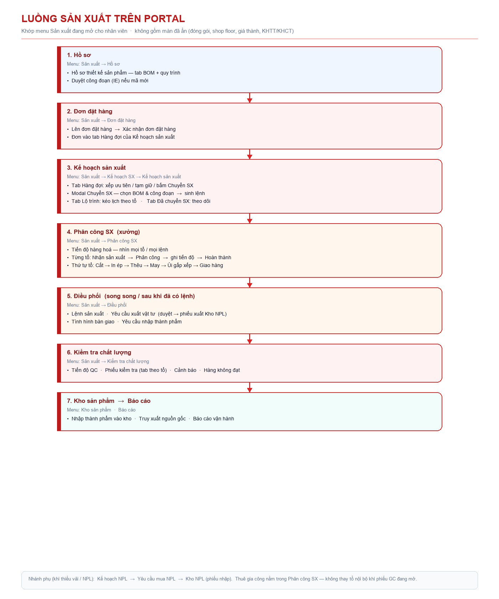
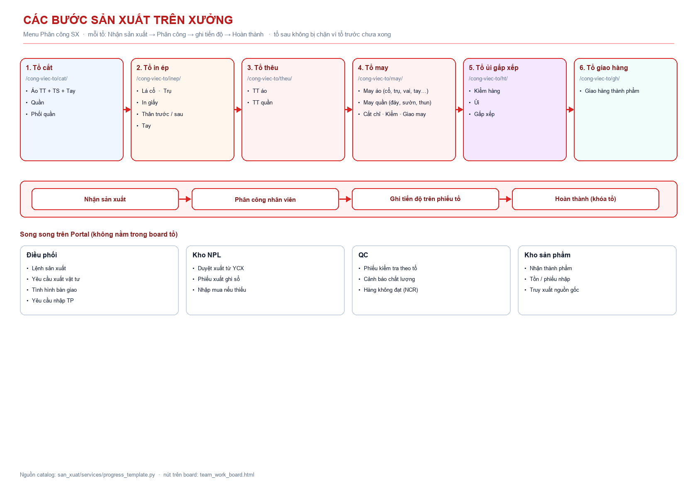

# Hướng dẫn sản xuất trên Portal JustPlay

Khảo sát theo **menu và nút đang mở** trên Portal (sidebar `Sản xuất`), không theo tài liệu thiết kế cũ.

Ảnh diagram tách riêng (dùng slide / in A3):

- [01-luong-portal.png](../../san_xuat/docs/diagrams/01-luong-portal.png)
- [02-buoc-xuong.png](../../san_xuat/docs/diagrams/02-buoc-xuong.png)

PDF: `san_xuat/docs/Quy_trinh_san_xuat_PortalJustPlay.pdf`  
Hướng dẫn từng màn: [huong-dan-tung-man.md](./huong-dan-tung-man.md)

---

## Menu nhân viên đang thấy

Thứ tự đúng trên sidebar:

| # | Menu | Màn chính |
|---|------|-----------|
| 1 | **Hồ sơ** | Hồ sơ thiết kế sản phẩm (BOM + quy trình) · Duyệt công đoạn · Năng lực SX |
| 2 | **Đơn đặt hàng** | Danh sách · Lên đơn đặt hàng · Xác nhận đơn đặt hàng |
| 3 | **Kế hoạch SX** | Kế hoạch sản xuất (3 tab) · Thời gian trung gian · Kế hoạch NPL · Yêu cầu mua NPL |
| 4 | **Kho NPL** | Tồn / phiếu nhập / phiếu xuất |
| 5 | **Điều phối** | Lệnh sản xuất · Yêu cầu xuất vật tư · Tình hình bàn giao · Yêu cầu nhập thành phẩm |
| 6 | **Phân công SX** | Tiến độ hàng hoá · 6 tổ · Thuê gia công |
| 7 | **Kiểm tra chất lượng** | Tiến độ QC · Phiếu kiểm tra · Cảnh báo · Hàng không đạt · Tiêu chuẩn |
| 8 | **Kho sản phẩm** | Tồn / phiếu nhập thành phẩm |
| 9 | **Báo cáo** | Truy xuất nguồn gốc · Báo cáo vận hành |

**Không nằm trên menu hàng ngày** (đừng train như bước bắt buộc): đóng gói, shop floor, giá thành, kế hoạch tổng thể / chi tiết, thống kê sản xuất.

---

## Sơ đồ 1 — luồng Portal



### Bước thao tác (tên nút đúng trên màn)

1. **Hồ sơ** → Hồ sơ thiết kế sản phẩm: có BOM đang dùng + quy trình / routing đã duyệt.
2. **Đơn đặt hàng** → Lên đơn đặt hàng → **Xác nhận đơn đặt hàng**.  
   Sau xác nhận đơn vào tab **Hàng đợi** — *chưa* sinh lệnh.
3. **Kế hoạch SX** → Kế hoạch sản xuất:
   - Tab **Hàng đợi**: ưu tiên, tạm giữ, bấm **Chuyển SX**.
   - Modal **Chuyển SX — BOM & công đoạn**: chọn hồ sơ rồi xác nhận.
   - Tab **Lộ trình**: kéo lịch theo tổ.
   - Tab **Đã chuyển SX**: theo dõi lệnh đã sinh.
4. **Phân công SX**:
   - **Tiến độ hàng hoá**: nhìn cả xưởng.
   - Vào từng tổ → **Nhận sản xuất** → **Phân công** → ghi tiến độ → **Hoàn thành**.
5. **Điều phối** (song song khi đã có lệnh):
   - Mở **Lệnh sản xuất** để kiểm tra.
   - **Yêu cầu xuất vật tư** → duyệt → phiếu xuất Kho NPL.
   - **Tình hình bàn giao** giữa công đoạn / tổ.
   - **Yêu cầu nhập thành phẩm** khi QC đủ điều kiện.
6. **Kiểm tra chất lượng** → Phiếu kiểm tra (tab theo tổ) → chốt Đạt; xử lý cảnh báo / hàng không đạt.
7. **Kho sản phẩm** nhận thành phẩm. **Báo cáo** → Truy xuất nguồn gốc nếu cần đối chiếu.

---

## Sơ đồ 2 — các bước trên xưởng



| Tổ trên menu | Đường dẫn | Việc chính |
|--------------|-----------|------------|
| Tổ cắt | `/san-xuat/cong-viec-to/cat/` | Cắt áo / quần / phối |
| Tổ in ép | `/san-xuat/cong-viec-to/inep/` | Lá cổ, trụ, in giấy, thân, tay |
| Tổ thêu | `/san-xuat/cong-viec-to/theu/` | TT áo / quần |
| Tổ may | `/san-xuat/cong-viec-to/may/` | May áo, may quần, kiểm, giao may |
| Tổ ủi gấp xếp | `/san-xuat/cong-viec-to/ht/` | Kiểm hàng, ủi, gấp xếp |
| Tổ giao hàng | `/san-xuat/cong-viec-to/gh/` | Giao hàng thành phẩm |

Trên mỗi phiếu tổ:

```text
Nhận sản xuất  →  Phân công  →  Ghi tiến độ  →  Hoàn thành
```

- **Nhận sản xuất** lần đầu: kế hoạch / lệnh chuyển sang *Đang sản xuất*.
- **Hoàn thành** chỉ khóa tổ đó. Tổ sau vẫn làm được nếu đã có việc.
- **Thuê gia công**: menu cùng nhóm Phân công SX — khi phiếu GC đang mở thì không phân công nội bộ tổ đó.

---

## Ai bấm nút nào

| Vai trò | Menu | Nút chính |
|---------|------|-----------|
| Lên đơn | Đơn đặt hàng → Lên đơn đặt hàng | Lưu đơn nháp |
| Duyệt đơn | Đơn đặt hàng → Xác nhận đơn đặt hàng | Xác nhận |
| Kế hoạch | Kế hoạch SX → Kế hoạch sản xuất | Chuyển SX · Lộ trình |
| Tổ trưởng | Phân công SX → tổ của mình | Nhận sản xuất · Phân công · Hoàn thành |
| Điều phối | Điều phối | Tạo / duyệt YCX · YCNTP · xem lệnh |
| Kho NPL | Kho NPL | Phiếu xuất sau khi YCX đã duyệt |
| QC | Kiểm tra chất lượng | Phiếu kiểm tra · Cảnh báo |
| Kho TP | Kho sản phẩm | Nhận thành phẩm |

---

## Checklist 1 đơn mẫu

| # | Việc | Menu / nút |
|---|------|------------|
| 1 | Có hồ sơ BOM + quy trình duyệt | Hồ sơ |
| 2 | Lên đơn → Xác nhận | Đơn đặt hàng |
| 3 | Tab Hàng đợi → **Chuyển SX** (chọn BOM) | Kế hoạch sản xuất |
| 4 | Tổ cắt: **Nhận sản xuất** → Phân công → Hoàn thành | Phân công SX |
| 5 | Lần lượt In ép / Thêu / May / Ủi / Giao hàng | Phân công SX |
| 6 | Tạo và duyệt **Yêu cầu xuất vật tư** | Điều phối + Kho NPL |
| 7 | Làm **Phiếu kiểm tra** theo tổ, chốt Đạt | Kiểm tra chất lượng |
| 8 | Tạo **Yêu cầu nhập thành phẩm** | Điều phối |
| 9 | Kiểm tồn **Kho sản phẩm** | Kho sản phẩm |
| 10 | Mở **Truy xuất nguồn gốc** đối chiếu | Báo cáo |

---

## Việc hay kẹt

| Hiện tượng | Nguyên nhân trên Portal | Xử lý |
|------------|-------------------------|--------|
| Không xác nhận được đơn | SMV / công đoạn trên đơn chưa đủ | Mở hồ sơ, duyệt routing, sửa đơn nháp |
| Không bấm được Chuyển SX | Đơn chưa xác nhận, hoặc thiếu quyền kế hoạch | Xác nhận đơn; cấp quyền Kế hoạch SX |
| Modal Chuyển SX báo thiếu hồ sơ | Mã SP chưa có BOM | Tạo hồ sơ thiết kế rồi mở lại modal |
| Tổ không thấy phiếu | Chưa Chuyển SX, hoặc tổ không nằm trong công đoạn đơn | Kiểm tab Đã chuyển SX + quy trình trên đơn |
| Không xuất được vật tư | Lệnh chưa phát hành (Chuyển SX chưa chạy) | Chuyển SX trước |
| Không nhập được thành phẩm | QC chưa Đạt hoặc còn cảnh báo mở | Chốt phiếu QC, đóng cảnh báo |
