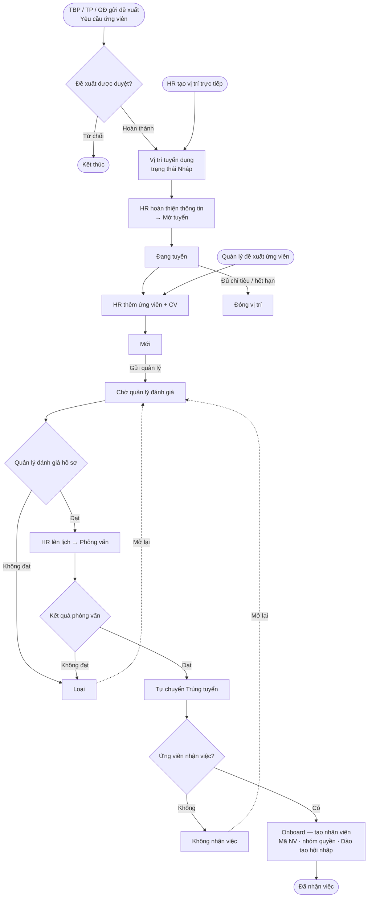
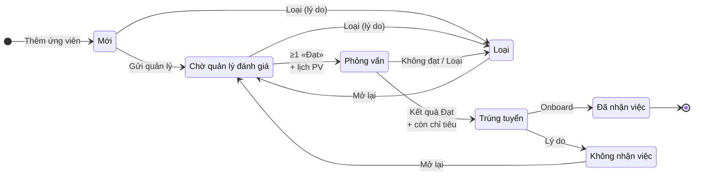
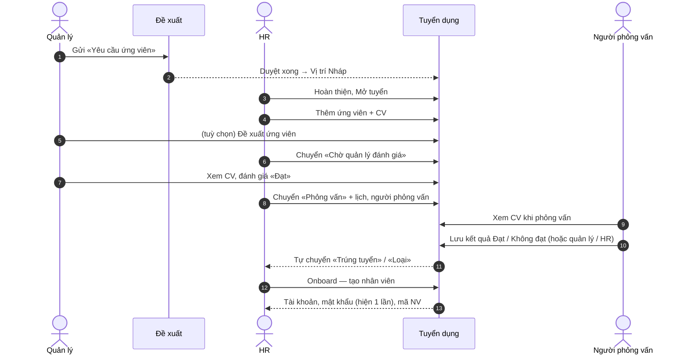

# Tuyển dụng — Mô tả, hướng dẫn sử dụng & luồng nghiệp vụ

Module **Tuyển dụng** quản lý toàn bộ vòng đời tuyển người: từ đề xuất tuyển được duyệt → mở vị trí → nhận hồ sơ → quản lý đánh giá → phỏng vấn → trúng tuyển → onboard thành nhân viên trên Portal.

Menu: **Nhân sự → Tuyển dụng**.

---

## 1. Mô tả

### 1.1. Vai trò

| Vai trò | Ai | Làm gì |
|---|---|---|
| **Người đề xuất** | Trưởng bộ phận, Trưởng phòng, Giám đốc | Gửi **Yêu cầu ứng viên (tuyển dụng)** qua **Yêu cầu → Gửi đề xuất** |
| **HR** | Phòng Hành chính nhân sự (nhóm quyền có menu Tuyển dụng) | Hoàn thiện & mở vị trí, nhập hồ sơ, lên lịch phỏng vấn, nhập kết quả, onboard |
| **Quản lý** | Trưởng bộ phận, Trưởng phòng, Giám đốc | Đánh giá hồ sơ ứng viên thuộc vị trí mình quản lý, đề xuất ứng viên |
| **Người phỏng vấn** | Người được HR chọn khi lên lịch | Xem hồ sơ & CV của ứng viên mình phỏng vấn |

### 1.2. Các màn hình

| Menu | Ai thấy | Nội dung |
|---|---|---|
| **Tổng quan** | HR | Số liệu, việc cần làm (phỏng vấn chờ kết quả, trúng tuyển chờ onboard, vị trí nháp) |
| **Vị trí tuyển dụng** | HR | Danh sách vị trí, tạo / sửa / mở / tạm dừng / đóng vị trí |
| **Ứng viên** | HR | Bảng Kanban theo bước, thêm ứng viên, trang chi tiết hồ sơ |
| **Lịch phỏng vấn** | HR | Danh sách buổi phỏng vấn theo khoảng ngày, xuất Excel, xem nhanh CV |
| **Đánh giá ứng viên** | Quản lý, người phỏng vấn | Hồ sơ chờ đánh giá, kết quả phỏng vấn, hồ sơ đã đánh giá, ứng viên mình đề xuất |
| **Thiết lập** | HR | Danh mục **Địa điểm họp**, **Loại hồ sơ**, **Nguồn hồ sơ** |

### 1.2a. Thiết lập danh mục

**Tuyển dụng → Thiết lập** có 3 tab, mỗi tab: bảng danh mục bên trái, khung **Thêm** bên phải; nút ✎ sửa, ⏸ / ▶ ngừng / dùng lại, 🗑 xóa.

| Danh mục | Dùng ở đâu | Quy tắc |
|---|---|---|
| **Địa điểm họp** | Ô **Địa điểm** khi lên lịch phỏng vấn (vẫn chọn được *Khác (nhập tay)…*) | Tên không trùng. Đổi tên → cập nhật các lịch chưa có kết quả. Xóa không ảnh hưởng lịch cũ |
| **Loại hồ sơ** | Ô **Loại** khi tải file đính kèm | Đánh dấu **Là CV** = file được mở khi bấm *Xem CV*. Luôn cần ≥ 1 loại *Là CV* đang dùng. *CV / Hồ sơ xin việc* là mục hệ thống |
| **Nguồn hồ sơ** | Ô **Nguồn hồ sơ \*** khi thêm ứng viên, bộ lọc Nguồn | *Quản lý đề xuất* là mục hệ thống — tự gán khi quản lý đề xuất, không chọn tay |

- Chỉ mục **Đang dùng** hiện trong ô chọn; hồ sơ cũ vẫn hiện đúng tên.
- Mục đã được dùng (nguồn / loại hồ sơ) **không xóa được** — chỉ **Ngừng dùng**.
- Ô **Thứ tự** để trống khi thêm → tự xếp cuối.

### 1.3. Trạng thái vị trí tuyển dụng

| Trạng thái | Ý nghĩa | Nhận hồ sơ? |
|---|---|---|
| **Nháp** | Mới tạo (tay hoặc tự động từ đề xuất), HR đang hoàn thiện | Không |
| **Đang tuyển** | Đang nhận hồ sơ đến hạn nộp | Có (khi chưa quá hạn) |
| **Tạm dừng** | Tạm ngưng nhận hồ sơ | Không |
| **Đã đóng** | Kết thúc tuyển | Không |

### 1.4. Trạng thái ứng viên

| Trạng thái (cột Kanban) | Ý nghĩa |
|---|---|
| **Mới** | HR vừa nhận hồ sơ |
| **Chờ quản lý đánh giá** (cột *Chờ đánh giá*) | Hồ sơ đã gửi quản lý phụ trách vị trí đánh giá |
| **Phỏng vấn** | Đã có lịch phỏng vấn |
| **Trúng tuyển** | Phỏng vấn Đạt, chờ nhận việc |
| **Đã nhận việc** | Đã onboard — có tài khoản nhân viên |
| **Không nhận việc** | Trúng tuyển nhưng ứng viên không đi làm |
| **Loại** | Không tiếp tục (không phù hợp / không đạt phỏng vấn) |

### 1.5. Quy tắc nghiệp vụ

Hệ thống kiểm tra các quy tắc dưới đây ở mọi thao tác (kéo thẻ, bấm nút). Vi phạm → hiện thông báo lỗi, trạng thái không đổi.

**Chuyển trạng thái ứng viên**

| Từ | Được chuyển sang | Điều kiện |
|---|---|---|
| Mới | Chờ quản lý đánh giá | Vị trí đã gắn phòng ban |
| Mới | Loại | Bắt buộc nhập lý do |
| Chờ quản lý đánh giá | Phỏng vấn | Có ít nhất 1 đánh giá **Đạt** của quản lý + chọn thời gian phỏng vấn |
| Chờ quản lý đánh giá | Loại | Bắt buộc nhập lý do |
| Phỏng vấn | Trúng tuyển | **Tự động** khi lưu kết quả **Đạt** + vị trí còn chỉ tiêu (Trúng tuyển + Đã nhận việc < Số lượng cần tuyển). Chuyển tay chỉ khi đã Đạt mà lúc đó vị trí đủ chỉ tiêu |
| Phỏng vấn | Loại | Bắt buộc nhập lý do (tự động khi nhập kết quả **Không đạt**) |
| Trúng tuyển | Đã nhận việc | Chỉ qua nút **Onboard — tạo nhân viên** |
| Trúng tuyển | Không nhận việc | Bắt buộc nhập lý do |
| Loại / Không nhận việc | Chờ quản lý đánh giá | Mở lại hồ sơ |
| Đã nhận việc | — | Trạng thái cuối, không chuyển tiếp |

**Vị trí tuyển dụng**

- Mở tuyển cần đủ: phòng ban, hạn nộp hồ sơ, mô tả công việc; hạn nộp chưa qua.
- Chỉ thêm ứng viên vào vị trí **Đang tuyển** và chưa quá hạn.
- Không nhận trùng số điện thoại (hoặc email) trong cùng một vị trí.
- Vị trí đã có ứng viên **không xóa được** — chỉ **Đóng vị trí**.

**Phỏng vấn**

- Một vòng phỏng vấn, kết quả **Đạt / Không đạt**.
- Chỉ nhập kết quả **sau giờ bắt đầu phỏng vấn**; **Không đạt** bắt buộc có nhận xét; mỗi buổi nhập kết quả **một lần**.
- Người nhập: **người phỏng vấn** được giao, **quản lý** phụ trách vị trí, hoặc HR có quyền Sửa.
- Lưu kết quả là hồ sơ **tự chuyển bước**: Đạt → **Trúng tuyển**, Không đạt → **Loại**. Nếu vị trí đã đủ chỉ tiêu, hồ sơ Đạt giữ ở **Phỏng vấn** kèm cảnh báo cho HR.

**Đánh giá của quản lý**

- Chỉ đánh giá khi hồ sơ ở bước **Chờ quản lý đánh giá**.
- Mỗi quản lý một đánh giá / ứng viên (gửi lại = cập nhật).
- **Không đạt** bắt buộc có nhận xét.

**Onboard**

- Chỉ ứng viên **Trúng tuyển**, vị trí đã gắn phòng ban, email (nếu có) chưa thuộc tài khoản khác.
- Người thực hiện cần quyền Tuyển dụng **và** quyền **Thêm** ở *Danh sách nhân viên*.

### 1.6. Phạm vi dữ liệu — ai thấy ứng viên nào

| Người dùng | Thấy vị trí & ứng viên của |
|---|---|
| Trưởng bộ phận | Vị trí gắn **bộ phận** mình làm trưởng |
| Trưởng phòng | Mọi vị trí của **phòng** mình làm trưởng (gồm các bộ phận trong phòng) |
| Giám đốc có gán phòng ban | Các phòng ban được gán (vị trí chính + kiêm nhiệm) |
| Giám đốc không gán phòng ban | Toàn công ty |
| Nhóm quyền có **Tuyển dụng — xem ứng viên mọi phòng ban** (HCNS, TGĐ) | Toàn công ty |
| Người được giao phỏng vấn | Hồ sơ + CV của ứng viên mình phỏng vấn |

- Vị trí **không chọn Bộ phận** = vị trí của cả phòng → chỉ Trưởng phòng / Giám đốc thấy và đánh giá.
- HR thấy mọi phòng ban nhưng **không đánh giá thay** quản lý phòng khác.

### 1.7. Hồ sơ / CV

- Mỗi ứng viên tối đa 10 file: PDF, Word (.doc, .docx), ảnh JPG/PNG; mỗi file tối đa 10MB.
- File được kiểm tra đuôi, nội dung thật và quét virus (nếu hệ thống bật quét).
- CV là dữ liệu cá nhân: lưu riêng tư, **không có link công khai**; mỗi lần mở đều kiểm tra quyền.
- **Xem CV** mở khung bên phải màn hình: PDF / ảnh xem trực tiếp, Word tải về. Khung không che trang — vừa đọc CV vừa nhập nhận xét được.

---

## 2. Luồng tổng quát (user flow)

### 2.1. Luồng trạng thái ứng viên

### 2.2. Ai làm bước nào

---

## 3. Hướng dẫn sử dụng

Các bước đánh số liên tục theo đúng thứ tự công việc thực tế.

### Quản lý — Gửi yêu cầu ứng viên

> Chỉ **Trưởng bộ phận, Trưởng phòng, Giám đốc** thấy loại đề xuất này, và chỉ yêu cầu cho phòng ban / bộ phận mình quản lý (phạm vi như mục 1.6).

**1.** Vào **Yêu cầu → Gửi đề xuất**.

**2.** **Chọn loại đề xuất**: *Yêu cầu ứng viên (tuyển dụng)*. Khung **Quy trình xử lý** bên phải hiện các bước duyệt và bước cuối *HCNS tiếp nhận tuyển dụng*.

**3.** Điền:

- **2. Thông tin chung** — **Tiêu đề**.
- **3. Chi tiết: Yêu cầu ứng viên (tuyển dụng)**
  - *Vị trí cần tuyển*: **Vị trí / chức danh**, **Số lượng**, **Ngày cần nhân sự**, **Phòng ban** (chỉ phòng bạn quản lý), **Bộ phận** (*— Cả phòng ban —* hoặc một bộ phận), **Lý do tuyển**.
  - *Yêu cầu ứng viên*: **Yêu cầu ứng viên** (kinh nghiệm, tay nghề, độ tuổi…).
  - **Mô tả công việc**.
- **4. Đính kèm** (tuỳ chọn) → **Gửi đề xuất**.

> Thông tin được chép sang vị trí nháp: *Vị trí / chức danh* → Tên vị trí (và Chức danh nếu khớp danh mục), *Phòng ban* / *Bộ phận* → Phòng ban / Bộ phận, *Số lượng* → Số lượng cần tuyển, *Ngày cần nhân sự* → Hạn nộp hồ sơ, *Lý do tuyển* + *Mô tả công việc* → Mô tả công việc, *Yêu cầu ứng viên* → Yêu cầu ứng viên.

**4.** Đề xuất đi qua các bước duyệt theo cấp của người gửi, bước cuối **HCNS tiếp nhận tuyển dụng**. Khi đề xuất **Hoàn thành**, hệ thống tự tạo vị trí tuyển dụng **Nháp** (nhật ký ghi *Đã tạo vị trí tuyển dụng nháp*). Trang chi tiết đề xuất có khung **Tuyển dụng**: vị trí, trạng thái, *Đã tuyển x / chỉ tiêu*, số hồ sơ và nút **Mở vị trí** (HR → form vị trí; quản lý → Đánh giá ứng viên). Đề xuất bị từ chối thì không tạo vị trí.

> Loại *Điều chuyển nhân sự* (trước là *Tuyển dụng và điều chuyển nhân sự*) chỉ còn điều chuyển; tuyển người dùng *Yêu cầu ứng viên*.

### HR — Hoàn thiện & mở vị trí

**5.** Vào **Nhân sự → Tuyển dụng → Tổng quan**. Khối **Vị trí nháp** liệt kê vị trí chờ hoàn thiện (ghi *từ đề xuất #…* nếu tạo tự động). Bấm tên vị trí.

> Tạo vị trí không qua đề xuất: **Vị trí tuyển dụng** → **Tạo vị trí** → điền form → **Tạo vị trí** (vị trí mới luôn ở trạng thái Nháp).

**6.** Form vị trí:

- **1. Thông tin vị trí**: **Tên vị trí**, **Phòng ban**, **Bộ phận** (để *— Cả phòng ban —* nếu tuyển cho cả phòng), **Chức danh**, **Số lượng cần tuyển**, **Hạn nộp hồ sơ** (dd/mm/yyyy).
- **2. Mô tả & yêu cầu**: **Mô tả công việc**, **Yêu cầu ứng viên**.
- Bấm **Lưu thay đổi**.

> Chọn **Bộ phận** quyết định quản lý nào đánh giá hồ sơ: có Bộ phận → Trưởng bộ phận đó (và Trưởng phòng); không có → chỉ Trưởng phòng / Giám đốc.

**7.** Khung **Tình trạng tuyển** bên phải → **Mở tuyển**. Vị trí chuyển **Đang tuyển**.

| Nút / ô | Việc làm |
|---|---|
| **Lưu thay đổi** | Lưu thông tin vị trí |
| **Hủy** | Về danh sách, không lưu |
| **Xóa vị trí** | Chỉ hiện khi vị trí chưa có ứng viên |
| **Mở tuyển** / **Mở lại** | Bắt đầu / mở lại nhận hồ sơ (cần đủ phòng ban, hạn nộp, mô tả; hạn chưa qua) |
| **Tạm dừng** | Ngưng nhận hồ sơ tạm thời |
| **Đóng vị trí** | Kết thúc tuyển |
| **Xem ứng viên** | Mở Kanban lọc theo vị trí |
| *Từ đề xuất #…* | Mở đề xuất gốc |

Danh sách **Vị trí tuyển dụng**: lọc **Trạng thái**, **Phòng ban**, ô **Tìm kiếm** → **Tìm**. Cột **Đã tuyển / Chỉ tiêu**, **Đang xử lý** (bấm số → Kanban của vị trí), **Hạn nộp** (đỏ khi đang tuyển mà quá hạn), biểu tượng bút → chi tiết.

### HR — Nhận hồ sơ ứng viên

**8.** **Ứng viên** → **Thêm ứng viên** (hoặc từ Kanban đã lọc vị trí — vị trí được chọn sẵn).

**9.** Điền:

- **1. Vị trí ứng tuyển** — chỉ liệt kê vị trí **Đang tuyển**, chưa hết hạn, trong phạm vi của bạn.
- **2. Thông tin ứng viên** — **Họ và tên**, **Số điện thoại** (bắt buộc), **Email**, **Nguồn hồ sơ** (*HR nhập hồ sơ / Ứng viên tự đến / Kênh online*).
- **3. Hồ sơ & ghi chú** — **CV / hồ sơ (PDF, Word, ảnh)** chọn được nhiều file, **Ghi chú**.
- Bấm **Lưu ứng viên** → mở trang chi tiết, thẻ nằm ở cột **Mới**.

**10.** Bổ sung CV sau: trang chi tiết → khung **Hồ sơ đính kèm** → chọn **Loại** (*CV / Hồ sơ xin việc* hoặc *Giấy tờ khác*) → **Chọn file** → **Tải lên**. Biểu tượng tải về / dấu **×** để tải / xóa file.

### HR — Gửi hồ sơ cho quản lý

**11.** Trên **Ứng viên** (Kanban): kéo thẻ từ **Mới** sang **Chờ đánh giá** → hộp xác nhận → **Xác nhận**.
Hoặc trang chi tiết → khung **Bước tiếp theo** → **Chờ quản lý đánh giá** → **Xác nhận**.

> Khi kéo thẻ, cột không hợp lệ bị mờ đi; thả vào cột hợp lệ luôn mở hộp xác nhận. Lỗi quy tắc hiện thông báo đỏ, thẻ ở nguyên chỗ.

Tab **Danh sách**: hàng chip trạng thái kèm số lượng — **Cần xử lý** gom các hồ sơ HR phải làm ngay (hồ sơ mới, đã có đề xuất PV, quá giờ PV chưa có kết quả, Đạt nhưng đủ chỉ tiêu, chờ onboard). Mỗi dòng có thanh **Tiến trình** (Mới → QL đánh giá → Phỏng vấn → Trúng tuyển → Nhận việc), cột **Bước tiếp theo** và một nút thao tác chính (*Gửi đánh giá*, *Lên lịch PV*, *Nhập kết quả*, *Onboard*) chỉ hiện khi quy tắc cho phép; nút **⋮** để chuyển thủ công.

Kanban: lọc **Vị trí** (*Tất cả vị trí chưa đóng* hoặc một vị trí), ô **Tìm ứng viên** (họ tên, SĐT, email). Thẻ hiển thị SĐT, nhãn *QL đề xuất*, số đánh giá (cột Chờ đánh giá), giờ & kết quả phỏng vấn (cột Phỏng vấn), lý do (cột Loại / Không nhận việc). Biểu tượng file trên thẻ = **Xem CV**. Cột **Đã nhận việc** không kéo vào / kéo ra được.

### Quản lý — Đánh giá hồ sơ

**12.** Vào **Nhân sự → Tuyển dụng → Đánh giá ứng viên** (số đỏ trên menu = hồ sơ chờ bạn đánh giá). Dưới tiêu đề hiện phạm vi bạn phụ trách.

| Tab | Nội dung |
|---|---|
| **Chờ đánh giá** | Hồ sơ ở bước chờ đánh giá, bạn chưa đánh giá |
| **Kết quả phỏng vấn** | Buổi phỏng vấn bạn được giao / thuộc phạm vi bạn, chưa có kết quả (xem bước 19) |
| **Đã đánh giá** | Kết luận + điểm bạn đã cho, trạng thái hiện tại |
| **Tôi đề xuất** | Ứng viên bạn giới thiệu và trạng thái |

**13.** Bấm **CV** để xem nhanh, hoặc **Đánh giá** để mở hồ sơ.

**14.** Trang hồ sơ: CV hiện ngay bên trái; khung **Đánh giá của bạn** bên phải → chọn **Đạt** / **Không đạt**, **Điểm hồ sơ** (1–5 sao, tuỳ chọn), **Nhận xét** → **Gửi đánh giá**. Gửi xong tự mở hồ sơ kế tiếp đang chờ bạn (**Hồ sơ khác** để bỏ qua). Muốn sửa: mở lại hồ sơ, đổi và gửi lại.

> Chỉ **Đạt** mới cho phép HR chuyển ứng viên sang phỏng vấn. **Không đạt** bắt buộc có nhận xét.

### Quản lý — Đề xuất ứng viên (tuỳ chọn)

**15.** **Đánh giá ứng viên** → **Đề xuất ứng viên** (nút chỉ hiện khi phòng/bộ phận bạn có vị trí đang tuyển) → điền như bước 9 → **Gửi đề xuất**. Ứng viên vào cột **Mới** với nguồn *Quản lý đề xuất*. Khi HR chưa tiếp nhận, bạn bổ sung CV được ở khung **Hồ sơ đính kèm**.

### HR — Lên lịch phỏng vấn

**16.** Ứng viên đã có **Đạt**: kéo thẻ sang **Phỏng vấn** (hoặc nút **Phỏng vấn** ở **Bước tiếp theo**). Hộp xác nhận yêu cầu:

- **Bắt đầu**, **Thời lượng**, **Kết thúc** (bắt buộc) — chọn bắt đầu + thời lượng (15 phút … 3 giờ) thì kết thúc tự tính; sửa kết thúc thì thời lượng tự cập nhật (*Tuỳ chỉnh*). Buổi phỏng vấn từ 15 phút đến 8 giờ.
- **Địa điểm**
- **Người phỏng vấn** (chọn nhiều — họ sẽ xem được CV ứng viên)

→ **Xác nhận**.

**17.** **Lịch phỏng vấn**: mặc định hiện các buổi sắp tới trong 3 ngày. Bộ lọc **Khoảng thời gian** (1/3/7/10/30 ngày), **Từ ngày**, **Đến ngày**, **Vị trí**, **Kết quả**. Giờ màu đỏ = đã qua giờ mà chưa có kết quả. Cột **CV** → **Xem**. **Xuất Excel** tải danh sách đang lọc (cần quyền Xuất).

### Người phỏng vấn / HR — Phỏng vấn & nhập kết quả

**18.** Khi phỏng vấn: trang chi tiết → khung **Phỏng vấn** → **Xem CV**. Khung CV mở bên phải (**Tab mới**, **Tải về**, **×** để đóng); trang bên trái vẫn thao tác được.

**19.** Sau giờ bắt đầu phỏng vấn, nhập kết quả ở một trong các nơi:

- **Người phỏng vấn / quản lý**: **Đánh giá ứng viên** → tab **Kết quả phỏng vấn** → **Nhập kết quả** (người phỏng vấn không phải quản lý cũng thấy menu này khi có buổi được giao).
- **HR**: **Ứng viên** → chip **Cần xử lý** → nút **Nhập kết quả** trên dòng, hoặc khung **Phỏng vấn** ở trang chi tiết.

Chọn **Đạt** / **Không đạt**, nhập **Nhận xét** → **Lưu kết quả**. Hồ sơ **tự chuyển bước**, không cần HR kéo thẻ:

- **Đạt** → **Trúng tuyển** (nếu vị trí đã đủ chỉ tiêu: giữ ở **Phỏng vấn**, cột *Bước tiếp theo* báo *Đạt — vị trí đủ chỉ tiêu*).
- **Không đạt** (bắt buộc nhận xét) → **Loại**, lý do = nhận xét.

### HR — Trúng tuyển & onboard

**20.** Hồ sơ Đạt đã tự vào **Trúng tuyển**. Chỉ khi vị trí đủ chỉ tiêu lúc lưu kết quả: tăng **Số lượng cần tuyển** rồi kéo thẻ sang **Trúng tuyển** (hoặc nút **Trúng tuyển**).

**21.** Ứng viên không đi làm: **Không nhận việc** → nhập **Lý do** → **Xác nhận**.

**22.** Ứng viên đi làm: trang chi tiết → **Bước tiếp theo** → chọn **Ngày nhận việc** → **Onboard — tạo nhân viên** → xác nhận. Dòng chú thích dưới nút cho biết phòng ban, nhóm quyền và khóa đào tạo sẽ gán.

**23.** Trang **Đã onboard …** hiện **Tên đăng nhập**, **Mật khẩu**, **Mã nhân viên**, **Phòng ban**, **Nhóm quyền**, **Đào tạo hội nhập**.

- **Mật khẩu chỉ hiện một lần** — bấm **Sao chép tài khoản** và gửi cho nhân viên. Nhân viên phải đổi mật khẩu khi đăng nhập lần đầu.
- **Hồ sơ nhân viên** → mở hồ sơ bên Nhân sự để bổ sung bộ phận, ngày sinh…
- **Hồ sơ ứng viên** → quay lại trang ứng viên (trạng thái **Đã nhận việc**).

Onboard tự động:

| Mục | Giá trị |
|---|---|
| Tài khoản | Tên đăng nhập theo họ tên (vd. *nam.nt*), mật khẩu ngẫu nhiên, bắt đổi khi đăng nhập |
| Mã nhân viên | Số tiếp theo trong hệ thống |
| Phòng ban / chức danh | Theo vị trí tuyển dụng |
| Nhóm quyền | *Nhân viên thử việc* (không có thì *Mặc định — Nhân viên*), đánh dấu thử việc |
| Đào tạo | Giao khóa **Đào tạo hội nhập** (+ bài kiểm tra cuối khóa nếu có) |

**24.** Đủ người: **Vị trí tuyển dụng** → vị trí → **Đóng vị trí**.

### HR — Mở lại hồ sơ

**25.** Ứng viên **Loại** / **Không nhận việc** → **Bước tiếp theo** → **Chờ quản lý đánh giá** → **Xác nhận**. Hồ sơ quay lại bước đánh giá, lý do cũ được xoá.

---

## 4. Tổng quan (dashboard HR)

| Khối | Nội dung | Bấm vào |
|---|---|---|
| **Vị trí đang tuyển** | Số vị trí đang mở | Danh sách lọc *Đang tuyển* |
| **Vị trí nháp chờ hoàn thiện** | Số vị trí nháp | Danh sách lọc *Nháp* |
| **Phỏng vấn 7 ngày tới** | Số buổi sắp diễn ra | Lịch phỏng vấn |
| **Nhận việc trong tháng** | Số người onboard tháng này | — |
| Dải trạng thái | Số ứng viên ở từng bước | — |
| **Phỏng vấn chờ nhập kết quả** | Buổi đã qua giờ, chưa có kết quả | Hồ sơ ứng viên |
| **Trúng tuyển chờ onboard** | Ứng viên Trúng tuyển | Hồ sơ ứng viên |
| **Phỏng vấn sắp tới** | 7 ngày tới | Hồ sơ ứng viên |
| **Vị trí nháp** | Nháp mới nhất | Form vị trí |

Nút **Vị trí**, **Ứng viên** góc phải mở nhanh hai màn chính.

---

## 5. Phân quyền (dành cho quản trị)

Cấu hình ở **Phân quyền → Nhóm quyền**, dòng **Nhân sự**:

| Dòng trong ma trận | Cho phép |
|---|---|
| **Tuyển dụng — Ứng viên (Kanban, phỏng vấn)** | Xem: Kanban, chi tiết, Lịch phỏng vấn · Thêm: thêm ứng viên · Sửa: chuyển trạng thái, lịch & kết quả PV, file, onboard · Xuất: Excel lịch phỏng vấn |
| **Tuyển dụng — Vị trí tuyển dụng** | Xem / Thêm / Sửa (gồm Mở tuyển, Tạm dừng, Đóng) / Xóa vị trí |
| **Tuyển dụng — Thiết lập** | Xem / Thêm / Sửa (gồm Ngừng dùng) / Xóa mục danh mục. Khi cập nhật, nhóm đang có quyền *Vị trí tuyển dụng* được cấp quyền tương ứng |
| **Tuyển dụng — xem ứng viên mọi phòng ban** (quyền bổ sung, cột Sửa) | Bỏ giới hạn phạm vi — thấy mọi phòng ban. Bật cho HR, TGĐ |
| **Danh sách nhân viên** — Thêm | Cần thêm để bấm **Onboard — tạo nhân viên** |

- Menu **Đánh giá ứng viên** không cần cấu hình: tự hiện cho Trưởng bộ phận / Trưởng phòng / Giám đốc.
- Phòng ban có giới hạn module (**Phân quyền menu** theo phòng ban) phải tick **Tuyển dụng** trong nhóm **Nhân sự**.
- Người có menu Tuyển dụng nhưng không có quyền bổ sung chỉ thấy phạm vi mình quản lý (mục 1.6); không quản lý phòng / bộ phận nào → không thấy ứng viên nào.

---

## 6. Thông báo lỗi thường gặp

| Thông báo | Nguyên nhân | Cách xử lý |
|---|---|---|
| *Cần ít nhất 1 đánh giá «Đạt» của quản lý.* | Chưa có quản lý đề xuất phỏng vấn | Chờ / nhắc quản lý phụ trách đánh giá |
| *Cần chọn thời gian bắt đầu / kết thúc phỏng vấn.* | Bỏ trống giờ khi chuyển Phỏng vấn | Chọn bắt đầu và thời lượng |
| *Thời gian kết thúc phải sau thời gian bắt đầu.* | Kết thúc ≤ bắt đầu | Sửa kết thúc hoặc chọn lại thời lượng |
| *Chỉ trúng tuyển khi kết quả phỏng vấn là «Đạt».* | Chưa lưu kết quả Đạt | Lưu kết quả ở khung Phỏng vấn |
| *Vị trí đã đủ chỉ tiêu (n).* | Trúng tuyển + Đã nhận việc = Số lượng | Tăng **Số lượng cần tuyển** hoặc chuyển người khác **Không nhận việc** |
| *Chưa tới giờ phỏng vấn.* | Nhập kết quả trước giờ hẹn | Nhập sau buổi phỏng vấn |
| *Buổi phỏng vấn đã có kết quả.* | Người khác đã nhập trước | Xem lịch sử ở trang chi tiết |
| *Bạn không được nhập kết quả phỏng vấn này…* | Không phải người PV / quản lý phụ trách / HR có quyền Sửa | Nhờ người phỏng vấn hoặc HR nhập |
| *Cần nhập lý do khi chuyển sang «…».* | Loại / Không nhận việc không có lý do | Nhập lý do |
| *Vị trí … không nhận hồ sơ (chưa mở hoặc đã hết hạn).* | Vị trí Nháp / Tạm dừng / Đóng / quá hạn | Mở tuyển hoặc gia hạn |
| *Số điện thoại … đã nộp cho vị trí này.* | Trùng hồ sơ | Dùng hồ sơ cũ |
| *Vị trí chưa gắn phòng ban — …* | Vị trí thiếu phòng ban | Cập nhật vị trí |
| *Vị trí đã có ứng viên — chỉ có thể đóng, không thể xóa.* | Xóa vị trí có hồ sơ | **Đóng vị trí** |
| *Ngoài phạm vi bạn phụ trách — …* | Tạo vị trí cho phòng / bộ phận không quản lý | Chọn đúng phạm vi |
| *Onboard cần thêm quyền «Thêm» ở Danh sách nhân viên (Nhân sự).* | Thiếu quyền HRM | Quản trị bật quyền |
| *Email … đã thuộc một tài khoản khác.* | Trùng email nhân viên | Kiểm tra lại / sửa email ứng viên |
| *Chỉ nhận PDF, Word hoặc ảnh JPG/PNG* | Sai định dạng / file giả đuôi | Đổi sang PDF / Word / ảnh |
| *Bạn không thể đánh giá hồ sơ này …* | Hồ sơ ngoài phạm vi hoặc không ở bước đánh giá | — |

---

## 7. Tóm tắt nút

**HR:** Tạo vị trí → Lưu thay đổi → **Mở tuyển** → **Thêm ứng viên** → **Lưu ứng viên** → kéo sang *Chờ đánh giá* → (quản lý đánh giá) → kéo sang *Phỏng vấn* (thời gian, người PV) → (người PV / quản lý **Lưu kết quả** → tự chuyển *Trúng tuyển*) → **Onboard — tạo nhân viên** → **Sao chép tài khoản** → **Đóng vị trí**.

**Quản lý:** **Gửi đề xuất** (Yêu cầu ứng viên) → **Đánh giá ứng viên** → **CV** → **Đánh giá** → **Gửi đánh giá** · (tuỳ chọn) **Đề xuất ứng viên** → **Gửi đề xuất**.

**Người phỏng vấn:** mở hồ sơ được giao → **Xem CV**.

---

## 8. Ghi chú kỹ thuật (cho IT)

| Thành phần | Vị trí |
|---|---|
| Quy tắc nghiệp vụ | `recruitment/services.py` |
| Phạm vi & quyền | `recruitment/permissions.py` |
| Vị trí nháp từ đề xuất | `service_requests/workflow.py` → `_create_recruitment_draft` |
| Lưu CV riêng tư | `MEDIA_ROOT/_private/recruitment/` (nginx chặn `/media/_private/`), xem qua `/hr/ho-so-ung-vien/<id>/` |
| Khóa đào tạo hội nhập | Khóa học tên **Đào tạo hội nhập** đang hoạt động (`services.ONBOARDING_COURSE_TITLE`) |
| Lịch sử thao tác | Bảng `CandidateEvent` — xem trong Django admin → Ứng viên |
| Dữ liệu test | `python manage.py seed_recruitment_test [--reset \| --clear]` |
| Test | `recruitment/tests_flow.py`, `recruitment/tests_permissions.py` |
